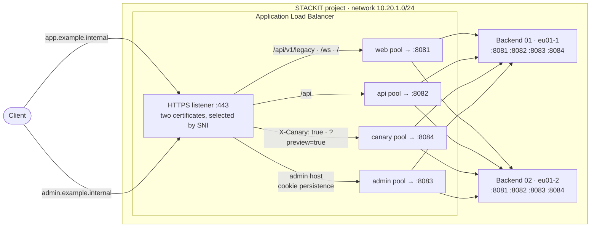

<!-- tags: iaas, alb, load-balancer, layer7, routing, tls, sni, ha, cross-az, canary, websocket -->

# ALB Multi-Tenant Routing

One STACKIT Application Load Balancer in front of several applications: two hostnames on a single HTTPS listener, path, header and query parameter rules, cookie persistence, WebSocket, and a target pool with its own health check per application.

## Overview

The other load balancer examples in this repository put one wildcard host in front of one target pool. That is enough for a single application, but the layer 7 features of the Application Load Balancer (ALB) are made for the case where one load balancer serves many tenants: applications or teams that share one public address and one listener and are told apart by host, path, header or query parameter. This example builds that case:

- **Host routing.** `app.<domain>` and `admin.<domain>` share the listener and the public IP. The load balancer selects the certificate by SNI and the rules by the `Host` header.
- **Path routing.** Under the app host, `/api` goes to the api pool and everything else to the web pool. One exact path, `/api/v1/legacy`, stays with the web application although the rest of the API has moved, which is how a monolith is taken apart one endpoint at a time.
- **Header and query parameter routing.** `X-Canary: true` or `?preview=true` send the same URL to a canary pool, so a new version can be released next to the current one without touching DNS or the clients.
- **Cookie persistence** on the admin pool keeps a client on the backend it started with.
- **WebSocket** upgrades on `/ws`.
- **One target pool per application**, each with an active HTTP health check, so an application that fails on one VM is removed from its own pool only.

Two backend VMs in different availability zones run the same small HTTP application on four ports, one per pool. Every pool contains both VMs, so two machines are enough to make every route highly available. Each response names the pool and the VM that served it, which makes every rule provable from the response body. See [Testing](#testing).

## Architecture



## What gets created

| Component     | Resource                                                                            | Purpose                                                                                                   |
| ------------- | ----------------------------------------------------------------------------------- | --------------------------------------------------------------------------------------------------------- |
| Network       | `stackit_network`, `stackit_security_group`, `stackit_security_group_rule`          | Private network and a security group that opens the four application ports inside the network             |
| Backends      | `stackit_server`, `stackit_network_interface` (one per AZ)                          | Debian VMs, provisioned by cloud-init with the test application (`files/server.py`) on ports 8081 to 8084 |
| Certificates  | `tls_private_key`, `tls_self_signed_cert`, `stackit_alb_certificate` (one per host) | Self-signed certificates for `app.<domain>` and `admin.<domain>`                                          |
| Load balancer | `stackit_application_load_balancer`                                                 | HTTPS listener with two hosts and seven rules, four target pools with health checks, public IP            |

The load balancer allocates its public IP itself (`options.ephemeral_address = true`) and releases it on destroy, so no `stackit_public_ip` is reserved up front. The address is bound to the lifetime of the load balancer; where DNS records have to point at a stable address, reserve a `stackit_public_ip` and pass it as `external_address` instead, as [`alb-tls-examples/vm-alb-self-signed-cert`](../alb-tls-examples/vm-alb-self-signed-cert/README.md) does. No DNS zone is created either; the hostnames are mapped to the address on the client with `curl --resolve`.

The backends need a security group of their own (`stackit_security_group.backend`): the load balancer attaches its target security group to the backend interfaces, and that group only permits traffic from the load balancer. Without an additional group with outbound rules the VMs cannot reach the metadata service and cloud-init never runs.

## Routing rules

The listener carries two hosts. Hosts are matched on the `Host` header, exact names before wildcards before `*`. Within a host the load balancer evaluates the rules in the order they are listed and the first match wins, so the specific rules are listed first and the catch-all last. A rule without a `path` matches every path.

| #   | Host             | Match                                       | Target pool     | Purpose                                                                            |
| --- | ---------------- | ------------------------------------------- | --------------- | ---------------------------------------------------------------------------------- |
| 1   | `app.<domain>`   | `path.exact_match = "/api/v1/legacy"`       | `alb-mt-web`    | Legacy endpoint that the web application still serves                              |
| 2   | `app.<domain>`   | `path.prefix = "/api"`                      | `alb-mt-api`    | The API; listed before the canary rules so that a canary header does not affect it |
| 3   | `app.<domain>`   | header `X-Canary: true`                     | `alb-mt-canary` | Canary release, selected by automated clients                                      |
| 4   | `app.<domain>`   | query parameter `preview=true`              | `alb-mt-canary` | Canary release, selected by a link handed to testers                               |
| 5   | `app.<domain>`   | `path.prefix = "/ws"`, `web_socket = true`  | `alb-mt-web`    | WebSocket endpoint of the web application                                          |
| 6   | `app.<domain>`   | `path.prefix = "/"`                         | `alb-mt-web`    | Everything else on the app host                                                    |
| 7   | `admin.<domain>` | `path.prefix = "/"`, cookie `admin-session` | `alb-mt-admin`  | Admin application with cookie persistence                                          |

Path prefixes match on segment boundaries: `/api` matches `/api` and `/api/users` but not `/apiary`. Header names are matched case-insensitively; header and query parameter values are exact, case-sensitive matches.

Each target pool forwards to its own port on both backends and runs the same active health check (`/healthz`, every 5 s, two failures to leave and two successes to rejoin the pool):

| Target pool     | Backend port | Rules   |
| --------------- | ------------ | ------- |
| `alb-mt-web`    | 8081         | 1, 5, 6 |
| `alb-mt-api`    | 8082         | 2       |
| `alb-mt-admin`  | 8083         | 7       |
| `alb-mt-canary` | 8084         | 3, 4    |

## Prerequisites

| Tool          | Version  |
| ------------- | -------- |
| Terraform     | >= 1.5.0 |
| curl, openssl | any      |

A STACKIT service account key with the `editor` role on the target project is required. The project needs quota for one load balancer, one public IP, two VMs and three security groups (one of the example, two that the load balancer creates for itself and its targets).

## Usage

### 1. Configure variables

```bash
cp terraform.tfvars.example terraform.tfvars
# fill in stackit_project_id and stackit_service_account_key_path
```

All other variables have defaults, see [`020-variables.tf`](020-variables.tf). `domain` changes the hostnames, `alb_plan_id` the service plan (`stackit beta alb plans` lists the plans of your region; `p10` is the only one in `eu01` at the time of writing and carries this configuration). If the project belongs to a STACKIT Network Area, `network_cidr` must lie inside the network ranges of that area; otherwise the network creation fails with `the prefix is not part of the allowed network ranges`.

### 2. Deploy

```bash
terraform init
terraform apply
```

The apply takes ten to fifteen minutes, most of it for the load balancer, which is created after the backends. By the time it is ready the backends have finished cloud-init and passed the health checks. If a request is still answered with `503 no healthy upstream`, wait a minute and retry.

### 3. Verify

The certificates are self-signed and no DNS zone exists, so the hostnames are mapped to the load balancer address with `--resolve`. That sets both the `Host` header and the TLS SNI, which is exactly what the load balancer routes on; the wildcard form maps every hostname on port 443 to the same address:

```bash
export ALB_IP=$(terraform output -raw alb_external_address)
export APP=$(terraform output -raw app_host)
export ADMIN=$(terraform output -raw admin_host)

curl -sk --resolve "*:443:$ALB_IP" "https://$APP/"
curl -sk --resolve "*:443:$ALB_IP" "https://$ADMIN/"
```

Both requests return a JSON body with the pool and the backend that answered:

```
{"host": "app.example.internal", "path": "/", "query": "", "pool": "web", "backend": "alb-mt-backend-01", "port": 8081}
{"host": "admin.example.internal", "path": "/", "query": "", "pool": "admin", "backend": "alb-mt-backend-02", "port": 8083}
```

## Testing

Every rule can be proven from the `pool` field of the response. The commands below assume the variables from [Verify](#3-verify); the pools listed are what the deployment described here returned. Repeat a command a few times to see both VMs of a pool appear in the `backend` field; the order is not a strict alternation.

### Host and path routing

| Command                                                            | Pool    | Why                                                 |
| ------------------------------------------------------------------ | ------- | --------------------------------------------------- |
| `curl -sk --resolve "*:443:$ALB_IP" "https://$APP/"`               | `web`   | Rule 6, catch-all of the app host                   |
| `curl -sk --resolve "*:443:$ALB_IP" "https://$APP/index.html"`     | `web`   | Rule 6                                              |
| `curl -sk --resolve "*:443:$ALB_IP" "https://$APP/api"`            | `api`   | Rule 2, prefix matches the segment itself           |
| `curl -sk --resolve "*:443:$ALB_IP" "https://$APP/api/users"`      | `api`   | Rule 2                                              |
| `curl -sk --resolve "*:443:$ALB_IP" "https://$APP/api/v1/legacy"`  | `web`   | Rule 1, exact match listed before the `/api` prefix |
| `curl -sk --resolve "*:443:$ALB_IP" "https://$APP/api/v1/legacy/"` | `api`   | Not the exact path any more, rule 2                 |
| `curl -sk --resolve "*:443:$ALB_IP" "https://$APP/api/v1/legacy2"` | `api`   | Not the exact path, rule 2                          |
| `curl -sk --resolve "*:443:$ALB_IP" "https://$APP/apiary"`         | `web`   | `/api` does not match `/apiary`, rule 6             |
| `curl -sk --resolve "*:443:$ALB_IP" "https://$ADMIN/"`             | `admin` | Rule 7, other host                                  |
| `curl -sk --resolve "*:443:$ALB_IP" "https://$ADMIN/api/users"`    | `admin` | The `/api` rule exists under the app host only      |

The whole matrix in one go:

```bash
for url in "$APP/" "$APP/index.html" "$APP/api" "$APP/api/users" "$APP/api/v1/legacy" \
           "$APP/api/v1/legacy/" "$APP/api/v1/legacy2" "$APP/apiary" "$ADMIN/" "$ADMIN/api/users"; do
  printf '%-40s ' "$url"; curl -sk --resolve "*:443:$ALB_IP" "https://$url"
done
```

A hostname that matches no host entry is answered by the load balancer itself with `404` and an empty body, and so is the bare IP address: the hosts are matched on the `Host` header, SNI only selects the certificate.

```bash
curl -sk --resolve "*:443:$ALB_IP" -o /dev/null -w '%{http_code}\n' "https://other.example.internal/"   # 404
curl -sk -o /dev/null -w '%{http_code}\n' "https://$ALB_IP/"                                           # 404
curl -sk -H "Host: $APP" "https://$ALB_IP/"                                                            # pool web
```

Port 80 has no listener; plain `http://` connections time out.

### Header and query parameter routing

| Command                                                                           | Pool     | Why                                                   |
| --------------------------------------------------------------------------------- | -------- | ----------------------------------------------------- |
| `curl -sk --resolve "*:443:$ALB_IP" -H 'X-Canary: true' "https://$APP/"`          | `canary` | Rule 3                                                |
| `curl -sk --resolve "*:443:$ALB_IP" -H 'X-Canary: true' "https://$APP/checkout"`  | `canary` | Rule 3, any path                                      |
| `curl -sk --resolve "*:443:$ALB_IP" -H 'X-Canary: false' "https://$APP/"`         | `web`    | Value is an exact match, rule 6                       |
| `curl -sk --resolve "*:443:$ALB_IP" -H 'x-canary: true' "https://$APP/"`          | `canary` | Header names are case-insensitive                     |
| `curl -sk --resolve "*:443:$ALB_IP" -H 'X-Canary: True' "https://$APP/"`          | `web`    | Header values are case-sensitive, rule 6              |
| `curl -sk --resolve "*:443:$ALB_IP" -H 'X-Canary: true' "https://$APP/api/users"` | `api`    | Rule 2 is listed before rule 3; the API has no canary |
| `curl -sk --resolve "*:443:$ALB_IP" -H 'X-Canary: true' "https://$APP/ws"`        | `canary` | Rule 3 has no path and is listed before rule 5        |
| `curl -sk --resolve "*:443:$ALB_IP" "https://$APP/?preview=true"`                 | `canary` | Rule 4                                                |
| `curl -sk --resolve "*:443:$ALB_IP" "https://$APP/pricing?utm=x&preview=true"`    | `canary` | Rule 4, other parameters are ignored                  |
| `curl -sk --resolve "*:443:$ALB_IP" "https://$APP/?preview=false"`                | `web`    | Value is an exact match, rule 6                       |
| `curl -sk --resolve "*:443:$ALB_IP" "https://$APP/?preview"`                      | `web`    | No value, rule 6                                      |
| `curl -sk --resolve "*:443:$ALB_IP" "https://$APP/api/users?preview=true"`        | `api`    | Rule 2 is listed before rule 4                        |
| `curl -sk --resolve "*:443:$ALB_IP" -H 'X-Canary: true' "https://$ADMIN/"`        | `admin`  | The canary rules exist under the app host only        |

### Certificates and SNI

Both certificates are attached to the same listener. The load balancer presents the one whose name matches the SNI of the handshake:

```bash
openssl s_client -connect "$ALB_IP:443" -servername "$APP" </dev/null 2>/dev/null | openssl x509 -noout -subject -nameopt RFC2253
openssl s_client -connect "$ALB_IP:443" -servername "$ADMIN" </dev/null 2>/dev/null | openssl x509 -noout -subject -nameopt RFC2253
openssl s_client -connect "$ALB_IP:443" -noservername </dev/null 2>/dev/null | openssl x509 -noout -subject -nameopt RFC2253
```

```
subject=CN=app.example.internal,O=STACKIT Example
subject=CN=admin.example.internal,O=STACKIT Example
subject=CN=admin.example.internal,O=STACKIT Example
```

A handshake without SNI, or with a name that matches none of the certificates, gets one of the attached certificates (the admin certificate in this deployment). Clients have to send the hostname as SNI to receive the matching certificate, which every browser and `curl --resolve` do.

### Cookie persistence

Without the cookie the requests to the admin pool are spread over both backends. The first response sets `admin-session`; requests that send it back land on the same backend:

```bash
# no cookie: both backends answer
for i in 1 2 3 4 5 6; do curl -sk --resolve "*:443:$ALB_IP" "https://$ADMIN/" | grep -o '"backend": "[^"]*"'; done | sort | uniq -c

# the first response sets the cookie ...
curl -sk --resolve "*:443:$ALB_IP" -c cookies.txt -D - -o /dev/null "https://$ADMIN/" | grep -i set-cookie

# ... and every request that sends it back reaches the same backend
for i in 1 2 3 4 5 6 7 8; do curl -sk --resolve "*:443:$ALB_IP" -b cookies.txt "https://$ADMIN/" | grep -o '"backend": "[^"]*"'; done | sort | uniq -c
```

```
   4 "backend": "alb-mt-backend-01"
   2 "backend": "alb-mt-backend-02"
set-cookie: admin-session="910f5fe4cd453715"; Max-Age=300; HttpOnly
   8 "backend": "alb-mt-backend-02"
```

`Max-Age` is the `session_cookie_ttl` variable. Responses to requests that already carry the cookie do not set it again, and the app host has no cookie persistence: `curl -sk --resolve "*:443:$ALB_IP" -D - -o /dev/null "https://$APP/"` returns no `Set-Cookie` header.

### WebSocket

Rule 5 enables WebSocket for `/ws`. A handshake request is answered with `101 Switching Protocols`, after which the backend sends one text frame that names pool and backend and echoes every frame it receives. The upgrade is an HTTP/1.1 mechanism, so curl is pinned to HTTP/1.1; it prints the response headers and the raw frame and gives up after the timeout, which is expected:

```bash
curl -sk --resolve "*:443:$ALB_IP" --http1.1 -i -N -m 3 \
  -H 'Connection: Upgrade' -H 'Upgrade: websocket' \
  -H 'Sec-WebSocket-Version: 13' -H "Sec-WebSocket-Key: $(openssl rand -base64 16)" \
  "https://$APP/ws"
```

```
HTTP/1.1 101 Switching Protocols
server: envoy
upgrade: websocket
connection: Upgrade
sec-websocket-accept: mFhn+IQx4r4Tgn7ryTMikIcIhn0=

{"pool": "web", "backend": "alb-mt-backend-01", "port": 8081, "message": "websocket established"}
```

The `sec-websocket-accept` value is derived from the key and differs per run; the two bytes in front of the JSON are the frame header. The same request to `/` (rule 6, no `web_socket`) is rejected by the load balancer with `403 Forbidden` and `connection: close`; the upgrade never reaches the backend.

### Health checks per pool

Each pool has its own health check, so an application that fails on one VM leaves its own pool only. `/healthz/fail/<seconds>` marks the pool that answers as unhealthy on the VM that answers for that many seconds (at most 3600; `/healthz/fail` uses 300). The path is matched by its last segments, so it works under every rule:

```bash
# mark the web application on the backend that answers as unhealthy for 60 s
curl -sk --resolve "*:443:$ALB_IP" "https://$APP/healthz/fail/60"

# after about ten seconds (two failed checks) every request to the web pool
# reaches the other backend ...
sleep 15
for i in 1 2 3 4 5 6 7 8; do curl -sk --resolve "*:443:$ALB_IP" "https://$APP/" | grep -o '"backend": "[^"]*"'; done | sort | uniq -c

# ... while the api pool on the same VM is still healthy and still uses both backends
for i in 1 2 3 4 5 6 7 8; do curl -sk --resolve "*:443:$ALB_IP" "https://$APP/api/users" | grep -o '"backend": "[^"]*"'; done | sort | uniq -c
```

```
{"healthy": false, "unhealthy_for_s": 60, "pool": "web", "backend": "alb-mt-backend-02", "port": 8081}
   8 "backend": "alb-mt-backend-01"
   2 "backend": "alb-mt-backend-01"
   6 "backend": "alb-mt-backend-02"
```

The backend rejoins the pool on its own once the duration has passed and the check has succeeded twice. A backend that is unhealthy receives no traffic, so `/healthz/ok`, which clears the state, only reaches a backend that is still or again in the pool. Marking both backends of a pool unhealthy makes the load balancer answer `503 no healthy upstream` for that pool while the other pools keep working.

## Notes

- Rule order is significant. The load balancer takes the first matching rule, so a catch-all `prefix = "/"` listed first shadows every rule after it. Keep exact matches and long prefixes before short ones and put header and query parameter rules where their scope should start.
- A rule without `path` matches every path. Rules 3 and 4 therefore also cover `/ws`, and neither has `web_socket`, so a canary client cannot open a WebSocket; a canary rule for `/ws` with `web_socket = true` listed before rule 3 would allow it.
- Requests whose `Host` matches no host entry are answered by the load balancer with an empty `404`; no backend is contacted. A host entry `*` gives such requests a default.
- Header names are matched case-insensitively, header and query parameter values case-sensitively and in full. `X-Canary: True` does not match `exact_match = "true"`.
- The private keys of the certificates are stored in the Terraform state. Protect the state accordingly.
- `stackit beta alb plans` lists the service plans of your region. At the time of writing only `p10` (two VMs in an active/passive setup, 10,000 connections) exists in `eu01`; further plans are announced. The limits of the resource are 20 listeners, 20 target pools and 250 targets per pool.

## Cleanup

```bash
terraform destroy
```

The load balancer releases its ephemeral public IP on destroy.

## References

- [Application Load Balancer: basic concepts](https://docs.stackit.cloud/products/network/load-balancing-and-content-delivery/application-load-balancer/basics/basic-concepts-alb/)
- [Application Load Balancer: features](https://docs.stackit.cloud/products/network/load-balancing-and-content-delivery/application-load-balancer/basics/features-alb/)
- [Application Load Balancer: service plans](https://docs.stackit.cloud/products/network/load-balancing-and-content-delivery/application-load-balancer/reference/service-plans/)
- [Terraform provider: `stackit_application_load_balancer`](https://registry.terraform.io/providers/stackitcloud/stackit/latest/docs/resources/application_load_balancer)
- [Terraform provider: `stackit_alb_certificate`](https://registry.terraform.io/providers/stackitcloud/stackit/latest/docs/resources/alb_certificate)
