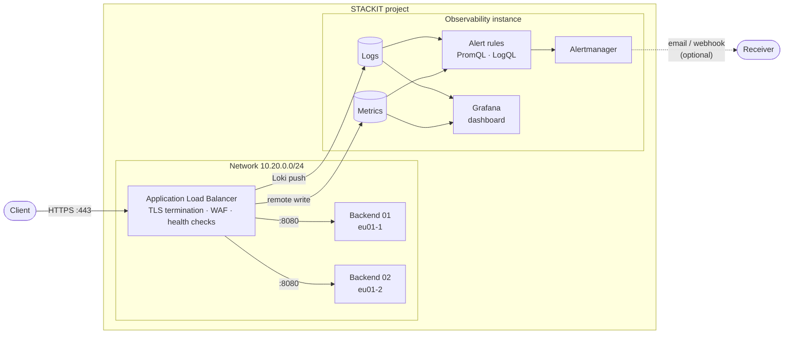

<!-- tags: iaas, alb, waf, load-balancer, layer7, observability, metrics, alerting, log-alerts, grafana, tls -->

# ALB Observability and Alerting

Ships the metrics and logs of a STACKIT Application Load Balancer into a STACKIT Observability instance and adds alert rules and a Grafana dashboard on top of them.

## Overview

The other load balancer examples in this repository show how to terminate TLS and how to block traffic with the WAF, but not how to see what the load balancer is doing. This example closes that gap:

- An Application Load Balancer (ALB) with an HTTPS listener, a self-signed certificate, an active HTTP health check and a minimal WAF configuration fronts two backend VMs in different availability zones.
- The ALB pushes its metrics (Prometheus remote write) and logs (Loki push API) to an Observability instance via `options.observability`. The push credentials are created by Terraform; the same technical user is exposed as outputs (`observability_username` and the sensitive `observability_password`) for the query commands in [Discovering metric and log names](#discovering-metric-and-log-names).
- The Observability instance evaluates PromQL alert rules (target pool health, health check failures, throughput anomalies, missing metrics) and LogQL alert rules (WAF block rate) and, optionally, routes notifications to an email address or a webhook.
- A Grafana dashboard in `dashboards/` visualises the same data.

The backend VMs run a small HTTP application whose health, status code, delay and response size can be chosen per request, so every alert can be triggered on purpose. See [Testing](#testing).

## Architecture



## What gets created

| Component        | Resource                                                                   | Purpose                                                                                          |
| ---------------- | -------------------------------------------------------------------------- | ------------------------------------------------------------------------------------------------ |
| Network          | `stackit_network`, `stackit_security_group`, `stackit_security_group_rule` | Private network and a security group for the backends                                            |
| Backends         | `stackit_server`, `stackit_network_interface` (one per AZ)                 | Debian VMs, provisioned by cloud-init with the test application (`files/server.py`) on port 8080 |
| Certificate      | `tls_private_key`, `tls_self_signed_cert`, `stackit_alb_certificate`       | Self-signed certificate for the HTTPS listener                                                   |
| Load balancer    | `stackit_public_ip`, `stackit_application_load_balancer`                   | HTTPS listener, target pool with active health check, log and metric shipping                    |
| WAF              | `stackit_alb_waf_managed_rule_set`, `_custom_rule_group`, `_configuration` | OWASP Core Rule Set plus one custom deny rule (`X-Waf-Demo: block`)                              |
| Observability    | `stackit_observability_instance`, `stackit_observability_credential`       | Instance that stores logs and metrics, technical user for pushing and querying                   |
| Push credentials | `stackit_loadbalancer_observability_credential`                            | Copy of the technical user in the load balancer service, referenced by `credentials_ref`         |
| Metric alerts    | `stackit_observability_alertgroup`                                         | Recording rules and PromQL alerts, see [Alert rules](#alert-rules)                               |
| Log alerts       | `stackit_observability_logalertgroup`                                      | LogQL alerts on the WAF log stream                                                               |

The WAF configuration is intentionally minimal. See [`iaas-cross-az-layer7-loadbalancer-waf`](../iaas-cross-az-layer7-loadbalancer-waf/README.md) for the full WAF example.

The backends need a security group of their own (`stackit_security_group.backend`): the load balancer attaches its target security group to the backend interfaces, and that group only permits traffic from the load balancer. Without an additional group with outbound rules the VMs cannot reach the metadata service and cloud-init never runs.

## What the load balancer exports

The load balancer pushes a fixed set of metrics and two log streams. This is what arrived in the Observability instance with provider 0.113.0 in August 2026:

| Data                | Names                                                                                                                                                                                                                                     | Labels                                                                                                          |
| ------------------- | ----------------------------------------------------------------------------------------------------------------------------------------------------------------------------------------------------------------------------------------- | --------------------------------------------------------------------------------------------------------------- |
| Health checks       | `lb_healthcheck_targets_healthy` (gauge), `lb_healthcheck_targets_failures_total` (counter)                                                                                                                                               | `stackit_lb_name`, `stackit_lb_project`, `stackit_lb_vm` (one per load balancer instance), `envoy_cluster_name` |
| Backend connections | `lb_target_pool_cx_active` (gauge), `lb_target_pool_cx_total`, `lb_target_pool_cx_rx_bytes_total`, `lb_target_pool_cx_tx_bytes_total` (counters)                                                                                          | same                                                                                                            |
| Envoy aliases       | `envoy_cluster_health_check_healthy`, `envoy_cluster_health_check_failure`, `envoy_cluster_upstream_cx_active`, `envoy_cluster_upstream_cx_total`, `envoy_cluster_upstream_cx_rx_bytes_total`, `envoy_cluster_upstream_cx_tx_bytes_total` | same values as the `lb_*` metrics                                                                               |
| WAF records         | Log stream `{component="waf"}`, JSON lines with the Coraza record in the `message` field                                                                                                                                                  | `component`, `level`, `service_name`, `stackit_lb_name`, `stackit_lb_project`                                   |
| Envoy system logs   | Log stream `{component="envoy"}`, JSON lines with `level`, `logger`, `message`                                                                                                                                                            | same                                                                                                            |

`envoy_cluster_name` is `<target pool>-<listener protocol>-<listener port>`, for example `alb-obs-backends-HTTPS-443`; the internal `xds_cluster` also appears and is excluded by the rules. The load balancer does **not** export request counts, response status codes or latencies, and the Envoy stream contains no access logs. Alerts on error ratios or latency therefore cannot be built from the load balancer telemetry today; request-level information is only available for requests inspected by the WAF. The metrics of the Observability instance itself (`instance_*`, for example `instance_remote_write_samples_rejected_total` and `instance_alert_rules_plan`) are available in the same instance.

## Prerequisites

| Tool      | Version  |
| --------- | -------- |
| Terraform | >= 1.5.0 |
| curl, jq  | any      |

A STACKIT service account key with the `editor` role on the target project is required. The project needs quota for one load balancer, one public IP, two VMs and one Observability instance.

## Usage

### 1. Configure variables

```bash
cp terraform.tfvars.example terraform.tfvars
# fill in stackit_project_id and stackit_service_account_key_path
```

All other variables have defaults, see [`020-variables.tf`](020-variables.tf). Set `alert_email` or `alert_webhook_url` to receive notifications; without a receiver the alert rules are still evaluated and visible in Alertmanager and Grafana.

### 2. Deploy

```bash
terraform init
terraform apply
```

The apply takes ten to twelve minutes: the Observability instance needs seven to eight minutes, and the load balancer, which references the push URLs and credentials of the instance and is therefore created afterwards, another four. The backends need three to four more minutes after the apply to finish cloud-init and pass the health check; until then the load balancer answers `503 no healthy upstream`.

### 3. Verify

```bash
export ALB_URL=$(terraform output -raw alb_url)

# the certificate is self-signed, hence -k
curl -k "$ALB_URL/"
curl -k "$ALB_URL/healthz"
```

Both requests return a JSON body with the name of the backend that answered.

## Discovering metric and log names

STACKIT documents that the load balancer is built on Envoy and that WAF records are shipped under the `component="waf"` log label, but it does not publish the names of the metrics the load balancer emits. The names in [What the load balancer exports](#what-the-load-balancer-exports) were read from a live instance with the commands below. Use them to confirm the names against your instance or to extend the rules:

```bash
export OBS_USER=$(terraform output -raw observability_username)
export OBS_PASS=$(terraform output -raw observability_password)
export METRICS_URL=$(terraform output -raw metrics_url)
export LOGS_URL=$(terraform output -raw logs_url)

# all metric names currently stored in the instance
curl -s -u "$OBS_USER:$OBS_PASS" "$METRICS_URL/api/v1/label/__name__/values" | jq -r '.data[]'

# labels of the load balancer series
curl -s -u "$OBS_USER:$OBS_PASS" -G "$METRICS_URL/api/v1/series" \
  --data-urlencode 'match[]={__name__=~"lb_.*"}' | jq '.data'

# labels used by the log streams and the values of the component label
curl -s -u "$OBS_USER:$OBS_PASS" "$LOGS_URL/loki/api/v1/labels" | jq
curl -s -u "$OBS_USER:$OBS_PASS" "$LOGS_URL/loki/api/v1/label/component/values" | jq

# most recent WAF records, message field only
curl -s -u "$OBS_USER:$OBS_PASS" -G "$LOGS_URL/loki/api/v1/query_range" \
  --data-urlencode 'query={component="waf"} | json | line_format "{{.message}}"' --data-urlencode 'limit=20' \
  | jq -r '.data.result[].values[][1]'
```

Metrics arrive within a minute after the load balancer has been created. If the list of metric names stays empty, refresh the state and inspect the `errors` attribute of the load balancer; it is only re-read from the API during a plan, apply or refresh:

```bash
terraform apply -refresh-only
terraform state show stackit_application_load_balancer.this | grep -A 3 errors
```

No output means the load balancer reports no errors. Entries of type `TYPE_METRICS_MISCONFIGURED` or `TYPE_LOGS_MISCONFIGURED` carry a description of what is wrong.

## Alert rules

All rules are evaluated every 60 seconds inside the Observability instance and are scoped to this load balancer via the `stackit_lb_name` label. Thresholds are variables, see [`020-variables.tf`](020-variables.tf).

| Alert                          | Type   | Condition                                                                                   | For | Severity |
| ------------------------------ | ------ | ------------------------------------------------------------------------------------------- | --- | -------- |
| `AlbTargetPoolDegraded`        | PromQL | Fewer healthy backends than configured on at least one load balancer instance, but not none | 1m  | warning  |
| `AlbTargetPoolUnhealthy`       | PromQL | No healthy backend left                                                                     | 1m  | critical |
| `AlbHealthCheckFailures`       | PromQL | Health checks keep failing (`rate(lb_healthcheck_targets_failures_total[5m]) > 0`)          | 5m  | warning  |
| `AlbTrafficSpike`              | PromQL | Backend throughput above three times the throughput of the previous hour                    | 5m  | warning  |
| `AlbTrafficDrop`               | PromQL | Backend throughput below 20 % of the throughput of the previous hour                        | 5m  | warning  |
| `AlbMetricsAbsent`             | PromQL | No load balancer metrics received for ten minutes                                           | 10m | warning  |
| `ObservabilitySamplesRejected` | PromQL | The Observability instance rejected metric samples (plan limit)                             | 0s  | warning  |
| `AlbWafBlockRateSpike`         | LogQL  | More than `alert_waf_blocks_per_5m` requests denied by the WAF in 5 minutes                 | 1m  | warning  |
| `AlbWafCustomRuleTriggered`    | LogQL  | The custom deny rule matched at least once in 5 minutes                                     | 0s  | info     |

`AlbTrafficSpike` requires the current throughput and `AlbTrafficDrop` the throughput of the previous hour to exceed `alert_traffic_min_bytes_per_second` (default 100 kB/s), so an idle load balancer does not alert. Two recording rules, `alb:healthy_targets:min` and `alb:throughput_bytes_per_second:rate5m`, store the healthy backend count and the throughput as pre-aggregated series for ad-hoc queries.

The Observability plan limits the number of rules in metric alert groups (`instance_alert_rules_plan`, 10 for `Observability-Starter-EU01`; current usage in `instance_alert_rules`). Recording rules count towards this limit, so this example uses nine of the ten; the two log alert rules are not counted. Changing a rule replaces the whole alert group.

## Dashboard

The dashboard in [`dashboards/alb-overview.json`](dashboards/alb-overview.json) shows healthy backends, health check failures, backend throughput and connections, denied WAF requests, WAF rule matches by rule ID, the sample usage of the Observability plan and the raw log streams. A `Load balancer` variable selects the load balancer by `stackit_lb_name`; set the `Configured backends` variable to the number of entries in `availability_zones` (default 2) so that the healthy backends stat turns orange when the pool is degraded. Import it once through the Grafana UI:

1. Open the Grafana URL from `terraform output grafana_url` and sign in with your STACKIT account.
2. Go to **Dashboards → New → Import**.
3. Click **Upload dashboard JSON file** and select `dashboards/alb-overview.json`.
4. Select the data sources of the instance when prompted (`Thanos` for Prometheus, `Loki` for Loki) and click **Import**.

The dashboard uses the built-in data sources of the instance, no additional configuration is needed.

## Testing

Every alert can be triggered from the command line. Allow one evaluation interval (60 s) plus the `for` duration of the rule before checking the alert state.

### Baseline traffic

```bash
export ALB_URL=$(terraform output -raw alb_url)

# roughly 5 requests per second for about 10 minutes (each call includes a TLS handshake)
for i in $(seq 1 3000); do curl -sk -o /dev/null "$ALB_URL/"; sleep 0.1; done
```

The backend answers `/status/<code>` with that status code and `/delay/<ms>` after that delay. Both are visible in the response, but not in the load balancer metrics, see [What the load balancer exports](#what-the-load-balancer-exports).

### Target pool health

```bash
# mark the backend that answers as unhealthy for five minutes;
# repeat until both backends have reported healthy: false
curl -k "$ALB_URL/healthz/fail"
curl -k "$ALB_URL/healthz/fail"
```

Each call marks the backend that happened to answer as unhealthy for five minutes (`/healthz/fail/<seconds>` sets a different duration, at most 3600). The response body names the backend. After the unhealthy threshold of the active health check has been reached the load balancer stops routing to that backend, so the second call reaches the other one.

Expected: `AlbTargetPoolDegraded` fires about two minutes after the first call, `AlbTargetPoolUnhealthy` about two minutes after the second, and `AlbHealthCheckFailures` after five minutes of failing checks. All three resolve on their own once the backends recover. While no backend is healthy the load balancer answers every request with `503 no healthy upstream`.

To recover earlier, call `/healthz/ok` until every backend has appeared in a response:

```bash
for i in $(seq 1 10); do curl -sk "$ALB_URL/healthz/ok"; done
```

A backend that is unhealthy while the other one is healthy receives no traffic and therefore cannot be reached this way; wait for it to recover.

### WAF blocks

```bash
# custom rule: denied by header match
curl -sk -o /dev/null -w '%{http_code}\n' -H 'X-Waf-Demo: block' "$ALB_URL/"

# OWASP Core Rule Set: denied by anomaly score (SQL injection pattern)
curl -sk -o /dev/null -w '%{http_code}\n' "$ALB_URL/?id=1%27%20OR%20%271%27%3D%271"

# more than alert_waf_blocks_per_5m blocked requests
for i in $(seq 1 20); do curl -sk -o /dev/null -H 'X-Waf-Demo: block' "$ALB_URL/"; done
```

Expected: both single requests return `403`. `AlbWafCustomRuleTriggered` fires on the next evaluation, `AlbWafBlockRateSpike` about two minutes after the loop.

### Throughput anomalies

Both rules compare the current backend throughput with the throughput of the previous hour and only fire when the current throughput (spike) or the throughput of the previous hour (drop) exceeds `alert_traffic_min_bytes_per_second`. The backend answers `/bytes/<n>` with a response of `n` bytes (at most 1 MiB), which makes it easy to move a lot of data with few requests.

```bash
# spike: about 2 MB/s for twelve minutes
end=$((SECONDS + 720))
while [ "$SECONDS" -lt "$end" ]; do
  seq 1 4 | xargs -P 4 -I{} curl -sk -o /dev/null "$ALB_URL/bytes/500000"
  sleep 1
done
```

Expected: `AlbTrafficSpike` fires about seven minutes into the loop (the five-minute rate window has to fill up, then the rule waits five minutes; with no traffic in the previous hour the threshold is reached earlier). `AlbTrafficDrop` fires about ten minutes after the loop has stopped, because the previous hour still contains the spike, and resolves once that hour has passed.

### Alert state

```bash
export ALERTING_URL=$(terraform output -raw alerting_url)

# active alerts in Alertmanager, metric and log alerts alike
curl -s -u "$OBS_USER:$OBS_PASS" "$ALERTING_URL/api/v2/alerts" | jq -r '.[].labels.alertname'

# evaluation state of the metric rules, including pending alerts
curl -s -u "$OBS_USER:$OBS_PASS" "$METRICS_URL/api/v1/rules" \
  | jq -r '.data.groups[].rules[] | select(.type == "alerting") | "\(.name)\t\(.state)"'
```

The same information is available in Grafana under **Alerting → Alert rules**; the dashboard shows the underlying metrics, not the alert state.

### Correlating a blocked request with its log records

Every WAF record carries a `unique_id` that is shared by all records of one request. List the denied requests, pick an ID and fetch everything the WAF logged for it:

```bash
curl -s -u "$OBS_USER:$OBS_PASS" -G "$LOGS_URL/loki/api/v1/query_range" \
  --data-urlencode 'query={component="waf"} |= "Access denied" | json | line_format "{{.message}}"' --data-urlencode 'limit=5' \
  | jq -r '.data.result[].values[][1]' | grep -o 'unique_id "[^"]*"'

curl -s -u "$OBS_USER:$OBS_PASS" -G "$LOGS_URL/loki/api/v1/query_range" \
  --data-urlencode 'query={component="waf"} |= "<id>" | json | line_format "{{.message}}"' \
  | jq -r '.data.result[].values[][1]'
```

The records list the matched rule (`id`, `msg`, `file`), the request URI, the client address and the anomaly score that led to the block. The custom rule of this example has the rule ID `1000`, blocks by the Core Rule Set carry the ID `949111` next to the ID of the rule that raised the anomaly score.

## Notes

- The password of the technical user is stored in the Terraform state. Protect the state accordingly.
- `stackit_loadbalancer_observability_credential` cannot be updated in place. Rotating the Observability credential replaces it and updates the load balancer.
- The metric names and labels are not documented by STACKIT and may change. If your instance reports different names, use the commands in [Discovering metric and log names](#discovering-metric-and-log-names) to adapt the rules and the dashboard.
- The Observability plan caps the metric samples per minute (`instance_remote_write_samples_max_1m`, 5,000 for `Observability-Starter-EU01`). The load balancer pushes the metrics, so an exceeded limit is not visible as an HTTP 429 to you; it shows up as `ObservabilitySamplesRejected` firing and as gaps in the dashboard. A single load balancer of plan `p10` with two backends pushes about 80 samples per minute, roughly two percent of that limit.
- STACKIT documents the standard log stream of the load balancer as Envoy system logs (start, stop, health) and lists enhanced log delivery as a roadmap item. Once request logs or metrics become available, the `/status/<code>` and `/delay/<ms>` endpoints of the backend can be used to test rules on them.

## Cleanup

```bash
terraform destroy
```

## References

- [Application Load Balancer: basic concepts](https://docs.stackit.cloud/products/network/load-balancing-and-content-delivery/application-load-balancer/basics/basic-concepts-alb/)
- [Application Load Balancer WAF: basic concepts](https://docs.stackit.cloud/products/network/load-balancing-and-content-delivery/application-load-balancer/basics/basic-concepts-alb-waf/)
- [STACKIT Observability](https://docs.stackit.cloud/products/logging-and-monitoring/observability/)
- [Terraform provider: `stackit_application_load_balancer`](https://registry.terraform.io/providers/stackitcloud/stackit/latest/docs/resources/application_load_balancer)
- [Terraform provider: `stackit_loadbalancer_observability_credential`](https://registry.terraform.io/providers/stackitcloud/stackit/latest/docs/resources/loadbalancer_observability_credential)
- [Terraform provider: `stackit_observability_alertgroup`](https://registry.terraform.io/providers/stackitcloud/stackit/latest/docs/resources/observability_alertgroup)
- [Terraform provider: `stackit_observability_logalertgroup`](https://registry.terraform.io/providers/stackitcloud/stackit/latest/docs/resources/observability_logalertgroup)
