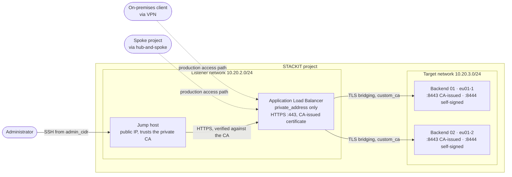

<!-- tags: iaas, alb, load-balancer, layer7, tls, pki, cert, encryption, networking, ha, cross-az -->

# Private ALB with End-to-End TLS

An internal-only STACKIT Application Load Balancer: no public address, load balancer and backends in separate networks, the target security group of the load balancer assigned by the configuration instead of by the service, and TLS from the client to the load balancer and again from the load balancer to the backends, verified against a private CA.

## Overview

The other load balancer examples in this repository publish services on the internet. Regulated customers often need the opposite: an API that is reachable from the company network or from other STACKIT projects and from nowhere else, encrypted on every hop. This example builds that case:

- **Private only.** `options.private_network_only = true`: the load balancer receives a `private_address` in the listener network and no public IP.
- **Load balancer and backends in separate networks.** The load balancer lives in a listener network, the backends in a target network; the two are connected by the project router, and the backend security groups admit the backend ports from the load balancer and the jump host only. The native way to express this, a second `networks` entry with the roles `ROLE_LISTENERS` and `ROLE_TARGETS`, was tried and does not work yet, see [Networks and security groups](#networks-and-security-groups).
- **Manual target security group.** `disable_target_security_group_assignment = true`: the load balancer does not touch the backend interfaces. The group it exports as `target_security_group` is assigned to the interfaces by this configuration; `load_balancer_security_group` is exported for own rules.
- **TLS bridging.** The load balancer terminates the client connection with a certificate issued by a private CA and opens a new TLS connection to the backend, whose certificate has to chain to the same CA (`tls_config` with `custom_ca` and `skip_certificate_validation = false`). A second pool whose backends present a certificate the CA did not issue shows that the validation is enforced.
- **Private CA at apply time.** CA, listener and backend certificates are created by the `tls` provider and delivered to the VMs via cloud-init. Nothing is committed.

Two backend VMs in different availability zones serve the API over HTTPS. A jump host in the listener network is the only resource with a public address; it exists so that the load balancer can be tested without a VPN, see [Access paths](#access-paths).

## Architecture



## What gets created

| Component       | Resource                                                                                     | Purpose                                                                                                                    |
| --------------- | -------------------------------------------------------------------------------------------- | -------------------------------------------------------------------------------------------------------------------------- |
| Networks        | `stackit_network` (listener, target)                                                         | Listener network for the load balancer and the jump host, target network for the backends                                  |
| Security groups | `stackit_security_group`, `stackit_security_group_rule` (jump host, backend)                 | SSH from `admin_cidr` to the jump host; backend ports reachable from the jump host for inspection                          |
| Jump host       | `stackit_key_pair`, `stackit_network_interface`, `stackit_public_ip`, `stackit_server`       | Debian VM with a public address that trusts the private CA                                                                 |
| Backends        | `stackit_network_interface`, `stackit_server` (one per AZ)                                   | Debian VMs with fixed addresses, provisioned by cloud-init with the HTTPS application (`files/server.py`)                  |
| Private CA      | `tls_private_key`, `tls_self_signed_cert`                                                    | CA that issues the listener and backend certificates                                                                       |
| Certificates    | `tls_private_key`, `tls_cert_request`, `tls_locally_signed_cert` (listener, one per backend) | CA-issued certificates; the listener certificate is uploaded as `stackit_alb_certificate`                                  |
| Load balancer   | `stackit_application_load_balancer`                                                          | Private listener in the listener network, two target pools with TLS bridging and health checks, no target group assignment |

## Networks and security groups

| Network                   | Members                                                 | Security groups on the interfaces                                                                                                                                                     |
| ------------------------- | ------------------------------------------------------- | ------------------------------------------------------------------------------------------------------------------------------------------------------------------------------------- |
| Listener (`10.20.2.0/24`) | Load balancer (`ROLE_LISTENERS_AND_TARGETS`), jump host | Jump host: `<prefix>-jumphost` (TCP 22 from `admin_cidr`). Load balancer: `loadbalancer/<name>/frontend-port` and `loadbalancer/<name>/backend-port`, created by the service          |
| Target (`10.20.3.0/24`)   | Backends, reached through the project router            | `<prefix>-backend` (TCP 8443-8444 from the jump host group) and `loadbalancer/<name>/backend`, the exported `target_security_group`, assigned in [`060-backends.tf`](060-backends.tf) |

The load balancer creates its security groups in both cases. With the default `disable_target_security_group_assignment = false` it also adds `target_security_group` to every interface whose address is a target, which only works for interfaces in its own network. Here the assignment is done by the configuration instead, which is what the option is for ("allow targets outside of the given network"). The alternative is to keep the backend interfaces free of the exported group and to write an own ingress rule with `remote_security_group_id = load_balancer_security_group.id`.

The backend interfaces need the exported group, the exported group only exists once the load balancer exists, and the load balancer needs the target addresses when it is created. The backends therefore use fixed addresses (`local.backend_ips`, host `10 + index` of the target network: `10.20.3.11` and `10.20.3.12` with the default zones and prefix), and the interfaces and VMs are created after the load balancer.

The API also offers a second `networks` entry with the roles `ROLE_LISTENERS` and `ROLE_TARGETS`, which would place the listener and the targets in different networks natively. This was tried with provider 0.113.0 in September 2026: the load balancer was created and reported `STATUS_READY`, received one interface in each network and a private address with the matching allowed-address pairs, but it never answered on that address; TCP 443 and ICMP from the listener network timed out, while an otherwise identical load balancer with a single network answered within seconds of becoming ready. The API reference states that only `ROLE_LISTENERS_AND_TARGETS` is supported at this time. This example therefore declares the listener network only and reaches the backends through the routing between the two networks of the project.

## Certificates

| Certificate | Issued by                 | Subject / SAN                                                | Used by                                                            |
| ----------- | ------------------------- | ------------------------------------------------------------ | ------------------------------------------------------------------ |
| CA          | itself                    | `<prefix> internal CA`                                       | `tls_config.custom_ca` of both pools, trust store of the jump host |
| Listener    | CA                        | `api.<internal_domain>`                                      | `stackit_alb_certificate` on the HTTPS listener                    |
| Backend     | CA, one per VM            | `<prefix>-backend-<NN>.<internal_domain>`, IP of the backend | Port 8443 of the backend                                           |
| Untrusted   | itself, created on the VM | `untrusted`                                                  | Port 8444 of the backend; the load balancer must refuse it         |

All private keys are stored in the Terraform state, and the backend keys are additionally part of the user data of the VMs. This is acceptable for a demonstration; a production setup issues the certificates from an existing PKI and delivers them through a secrets manager.

> [!IMPORTANT]
>
> `options.private_network_only`, `disable_target_security_group_assignment`, `networks` and `external_address` cannot be changed after the load balancer has been created. Changing any of them means destroying and recreating the load balancer, which also changes the private address. Terraform plans that replacement itself for the last three; a change of `options.private_network_only` is planned as an in-place update in provider 0.113.0, so force the replacement with `terraform apply -replace=stackit_application_load_balancer.this`. Decide on private-only and on the network layout before the first apply.
>
> When the load balancer is replaced, the backend interfaces still carry its `target_security_group`. Detach the group first, for example by removing it from `security_group_ids` in [`060-backends.tf`](060-backends.tf) and running `terraform apply -target=stackit_network_interface.backend`, then restore the line and apply the replacement; the interfaces receive the group of the new load balancer in the same run. This is how the deployment described here was switched from two networks to one.

## Access paths

There is no public entry point. The jump host of this example is a convenience for the demonstration: a VM with a public address in the listener network, SSH restricted to `admin_cidr`, from which the checks below are run. The intended consumers of a private load balancer are

- clients on-premises, connected through a STACKIT VPN gateway; see [`vpn-stackit-stackit`](../vpn-stackit-stackit/README.md), [`vpn-stackit-azure`](../vpn-stackit-azure/README.md) and [`vpn-stackit-gcp`](../vpn-stackit-gcp/README.md) for the tunnels, or
- workloads in other projects, routed through a central firewall; see [`opnsense-hub-and-spoke`](../opnsense-hub-and-spoke/README.md).

In both cases the remote side needs a route to the listener network only. The load balancer accepts the listener port from any source that reaches it (the `frontend-port` group the service creates permits TCP 443 from `0.0.0.0/0`); `options.access_control.allowed_source_ranges` narrows that to the client ranges. The backends are never addressed by the clients, and their security groups admit the backend ports from the load balancer and the jump host only.

## Prerequisites

| Tool                   | Version  |
| ---------------------- | -------- |
| Terraform              | >= 1.5.0 |
| STACKIT CLI            | latest   |
| ssh, curl, openssl, jq | any      |

A STACKIT service account key with the `editor` role on the target project is required. The project needs quota for one load balancer, one public IP, three VMs, two networks and five security groups (two of the example, three created by the load balancer). The STACKIT CLI is used only by the checks in [Testing](#testing) that read the load balancer and the network interfaces through the API; it has to be logged in and configured for the project (`stackit config set --project-id <id>`).

## Usage

### 1. Configure variables

```bash
cp terraform.tfvars.example terraform.tfvars
# fill in stackit_project_id, stackit_service_account_key_path, admin_cidr and ssh_public_key
```

`admin_cidr` is the address range that may reach the jump host over SSH (`curl -s https://ifconfig.me` shows your egress address). All other variables have defaults, see [`020-variables.tf`](020-variables.tf). In a project that belongs to a STACKIT Network Area, `listener_network_cidr` and `target_network_cidr` must lie inside the network ranges of that area.

### 2. Deploy

```bash
terraform init
terraform apply
```

The apply takes about ten minutes: the load balancer needs four to five and is created before the backend VMs, which need its target security group and take another three. Until the backends have finished cloud-init and passed the health checks, the load balancer answers `503 no healthy upstream`.

### 3. Verify

The load balancer has no public address; the checks run on the jump host, which trusts the private CA:

```bash
terraform output alb_private_address
terraform output -raw ssh_command

ssh debian@$(terraform output -raw jumphost_public_ip)
```

On the jump host, map the hostname to the private address with `--resolve` (no DNS zone exists) and call the API. No `-k` is needed, the certificate chain is verified against the CA in the system trust store:

```bash
export ALB_IP=<alb_private_address>
export API=api.internal.example

curl --resolve "$API:443:$ALB_IP" "https://$API/"
```

The response comes from a backend over TLS bridging and names the backend, the TLS version and cipher of the connection between load balancer and backend, and the fingerprint of the backend certificate:

```
{"backend": "alb-priv-backend-01", "port": 8443, "path": "/", "tls_version": "TLSv1.2", "cipher": "ECDHE-RSA-AES256-GCM-SHA384", "certificate_sha256": "F1:FE:70:48:9A:38:66:04:38:06:02:B9:27:17:AC:5E:FD:55:C5:8D:C3:8F:CD:50:5C:32:7D:B5:61:B8:F3:86"}
```

## Testing

All commands run on the jump host with the variables from [Verify](#3-verify) unless marked otherwise; the outputs are what the deployment described here returned.

### The load balancer is private

```bash
# on the workstation
terraform output alb_private_address
stackit beta alb describe alb-priv-alb --output-format json | jq -c '{externalAddress, privateAddress, status}'
```

```
"10.20.2.254"
{"externalAddress":null,"privateAddress":"10.20.2.254","status":"STATUS_READY"}
```

The only address is the private one, so the load balancer cannot be addressed from the internet. The interfaces of the load balancer, two per instance plus the port that holds the private address, all live in the listener network; every network with a route to it reaches the listener, see [Access paths](#access-paths).

### TLS from the client to the load balancer

```bash
openssl s_client -connect "$ALB_IP:443" -servername "$API" </dev/null 2>/dev/null \
  | openssl x509 -noout -subject -issuer -nameopt RFC2253
openssl s_client -connect "$ALB_IP:443" -servername "$API" -CAfile /etc/ssl/certs/ca-certificates.crt </dev/null 2>/dev/null | grep 'Verify return code'
```

```
subject=CN=api.internal.example,O=STACKIT Example
issuer=CN=alb-priv internal CA,O=STACKIT Example
Verify return code: 0 (ok)
```

The client connection uses TLS 1.3. A request for another hostname (`curl --resolve "other.internal.example:443:$ALB_IP" https://other.internal.example/`) fails on the client already, because the listener certificate is issued for `api.<internal_domain>` only; with `-k` the load balancer answers such requests with `404`, as it does for the bare IP address. Port 80 has no listener.

### TLS from the load balancer to the backends

Every response carries the fingerprint of the certificate the backend presented to the load balancer. It is the certificate that Terraform issued for that backend:

```bash
curl --resolve "$API:443:$ALB_IP" "https://$API/"

# on the workstation: fingerprint of the certificate issued for backend 01
terraform show -json | jq -r '.values.root_module.resources[] | select(.address == "tls_locally_signed_cert.backend[\"01\"]") | .values.cert_pem' \
  | openssl x509 -noout -fingerprint -sha256
```

The backends can also be inspected directly from the jump host; port 8443 verifies against the CA, port 8444 does not:

```bash
export BACKEND=<backend_private_ips["01"]>
openssl s_client -connect "$BACKEND:8443" -CAfile /etc/ssl/certs/ca-certificates.crt </dev/null 2>/dev/null | grep -E 'subject=|issuer=|Verify return code'
openssl s_client -connect "$BACKEND:8444" -CAfile /etc/ssl/certs/ca-certificates.crt </dev/null 2>/dev/null | grep -E 'subject=|issuer=|Verify return code'
```

```
subject=O = STACKIT Example, CN = alb-priv-backend-01.internal.example
issuer=O = STACKIT Example, CN = alb-priv internal CA
Verify return code: 0 (ok)
subject=CN = untrusted
issuer=CN = untrusted
Verify return code: 18 (self-signed certificate)
```

The fingerprint in the responses through the load balancer is the one of the certificate on port 8443. The load balancer negotiated TLS 1.2 with the backends in this deployment, the direct connection from the jump host TLS 1.3; both are decided by the load balancer respectively the client, not by the backend.

### Certificate validation is enforced

The `/untrusted` rule sends requests to a pool whose targets are port 8444, where the backends present a self-signed certificate. The load balancer refuses that certificate:

```bash
curl -s -o /dev/null -w '%{http_code}\n' --resolve "$API:443:$ALB_IP" "https://$API/untrusted"
```

```
503
```

The body is `no healthy upstream`: the health check uses the same TLS configuration as the traffic, so the checks against port 8444 fail the certificate validation, the pool never has a healthy target and the load balancer answers every request to it with `503`. The pool on port 8443 passes the identical check. This also answers how the HTTP health check behaves against HTTPS backends, for which the provider offers no separate TLS setting: it verifies the backend certificate against `custom_ca` like the traffic does. With `skip_certificate_validation = true` both pools would be healthy; the option exists for tests and should not be used for an internal API.

### Security groups

```bash
# on the workstation
terraform output target_security_group
terraform output load_balancer_security_group
stackit network-interface list --network-id $(terraform show -json | jq -r '.values.root_module.resources[] | select(.address == "stackit_network.target") | .values.network_id') --output-format json \
  | jq '.[] | {name, ipv4, securityGroups}'
```

```
{"name":"alb-priv-backend-01","ipv4":"10.20.3.11","securityGroups":["b61786d7-8bab-457e-97b4-71268fd2b1a4","f396f5a1-d6f3-459d-8144-8a4490994d33"]}
{"name":"alb-priv-backend-02","ipv4":"10.20.3.12","securityGroups":["b61786d7-8bab-457e-97b4-71268fd2b1a4","f396f5a1-d6f3-459d-8144-8a4490994d33"]}
```

Each backend interface carries two groups: the group of the example and `loadbalancer/alb-priv-alb/backend`, the exported `target_security_group`. Its rules permit TCP 8443 and 8444, the target ports of the two pools, from the `load_balancer_security_group` (`loadbalancer/alb-priv-alb/backend-port`) that the load balancer's own interfaces carry; a third group, `loadbalancer/alb-priv-alb/frontend-port`, opens the listener port on the interfaces that hold the private address. The load balancer itself has not added anything to the backend interfaces.

## Notes

- `private_network_only`, `disable_target_security_group_assignment`, `networks` and `external_address` are immutable, see above. The `private_address` is described by the API as transient; do not hard-code it in clients, resolve a name instead.
- The provider does not expose the TLS settings of the HTTP health check (`httpHealthChecks.tls` in the API). The check runs over the `tls_config` of the pool anyway, see [Certificate validation is enforced](#certificate-validation-is-enforced).
- Backend certificates carry the fixed address of the backend and a name under the internal domain as subject alternative names. The load balancer accepted them; whether it matches the name or the address against the target was not tested separately, so keep both.
- Both pools share the same `tls_config`; the difference is only the certificate the backends present on the target port. `custom_ca` is added to the system-trusted CAs of the load balancer, so a backend with a certificate from a public CA would be accepted as well.
- The CA key, the listener key and the backend keys are stored in the Terraform state; the backend keys are also part of the user data. Protect the state, and issue the certificates from your PKI for anything beyond a demonstration.
- `stackit beta alb plans` lists the service plans of your region; at the time of writing only `p10` exists in `eu01`.

## Cleanup

```bash
terraform destroy
```

## References

- [Application Load Balancer: basic concepts](https://docs.stackit.cloud/products/network/load-balancing-and-content-delivery/application-load-balancer/basics/basic-concepts-alb/)
- [Application Load Balancer: features](https://docs.stackit.cloud/products/network/load-balancing-and-content-delivery/application-load-balancer/basics/features-alb/)
- [Terraform provider: `stackit_application_load_balancer`](https://registry.terraform.io/providers/stackitcloud/stackit/latest/docs/resources/application_load_balancer)
- [Terraform provider: `stackit_alb_certificate`](https://registry.terraform.io/providers/stackitcloud/stackit/latest/docs/resources/alb_certificate)
- [Terraform provider: `tls_locally_signed_cert`](https://registry.terraform.io/providers/hashicorp/tls/latest/docs/resources/locally_signed_cert)
