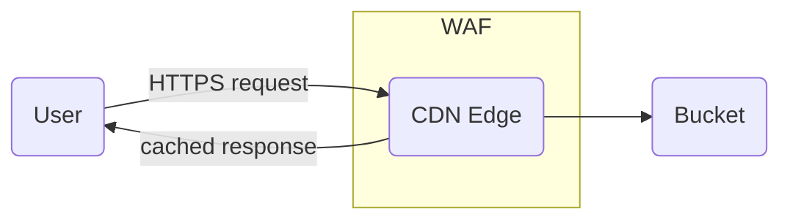

# Static Website on STACKIT CDN with S3 Backend

A reference implementation showing how to deploy a static website using [STACKIT CDN](https://stackit.com/en/products/network/stackit-cdn) with [STACKIT Object Storage](http://stackit.com/en/products/storage/stackit-object-storage) as the origin.

---

## Architecture



---

## Prerequisites

- [Terraform](https://developer.hashicorp.com/terraform/install) >= 1.5
- A STACKIT project
- A STACKIT service account with sufficient permissions
- A STACKIT service account JSON key file

---

## Setup

Copy `terraform.tfvars.example` to `terraform.tfvars` and fill in your values, then run:

```bash
terraform init
terraform apply
```

After `apply`, visit the output domain:

```
cdn_managed_domain = "https://abc123.stackit.cdn"
```

---

## Configuration

### Variables

| Variable                           | Description                                 | Default  |
| ---------------------------------- | ------------------------------------------- | -------- |
| `stackit_project_id`               | STACKIT project ID                          | —        |
| `stackit_service_account_key_path` | Path to SA key JSON                         | —        |
| `stackit_region`                   | STACKIT region                              | `eu01`   |
| `cdn_enabled_regions`              | CDN regions: `EU`, `US`, `ASIA`, `AF`, `SA` | `["EU"]` |
| `cdn_blocked_countries`            | ISO 3166-1 alpha-2 codes to block           | `[]`     |

---

## Verify Redirect and WAF

### Redirect

The example configures a **301 redirect** from `/old/home` to `/`. Test it:

```bash
URL=$(terraform output -raw cdn_managed_domain)

# Should return 301 with Location header pointing to /
curl -sI "${URL}/old/home"

# Direct access should return 200
curl -sI "${URL}/"
```

Expected redirect response:

```
HTTP/2 301
location: /
...
```

### WAF

The example enables the WAF in `ENABLED` mode with `@builtin/crs/request` rules, restricting accepted methods to `GET` and `HEAD`.

```bash
URL=$(terraform output -raw cdn_managed_domain)

# GET request — allowed (200)
curl -sI "${URL}/"

# POST request — blocked by WAF (403)
curl -sI -X POST "${URL}/"

# HEAD request — allowed (200)
curl -sI --head "${URL}/"
```

If the WAF blocks the `POST` request correctly, you'll see a `403 Forbidden` response. If you see `200 OK`, the WAF is either not yet active or misconfigured.

---

## Cleanup

```bash
terraform destroy
```

---

## References

- [STACKIT CDN Documentation](https://docs.stackit.cloud/products/network/load-balancing-and-content-delivery/cdn)
- [STACKIT Object Storage Documentation](https://docs.stackit.cloud/products/storage/object-storage)
- [STACKIT Terraform Provider](https://registry.terraform.io/providers/stackitcloud/stackit/latest/docs)
