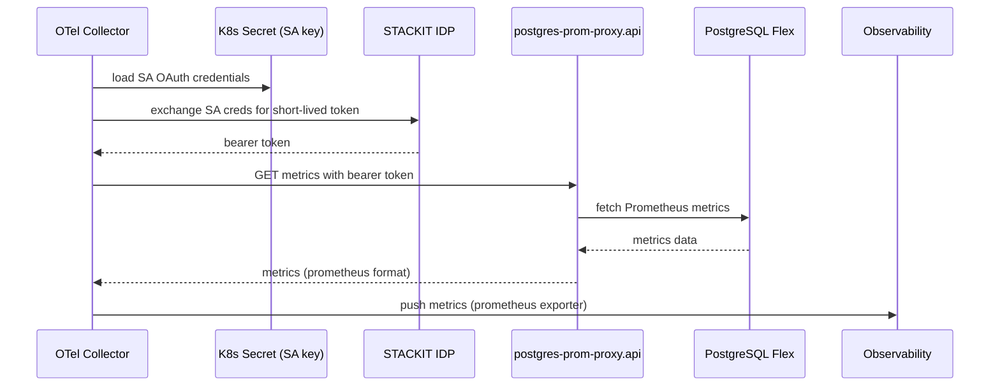
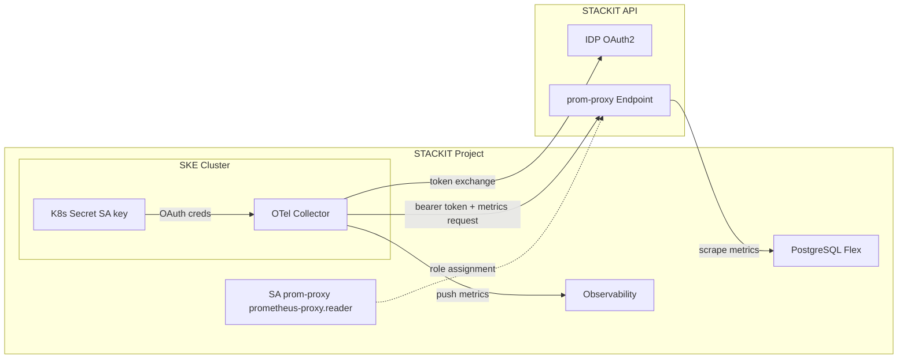

# DBaaS OpenTelemetry Metrics Collection

Collect metrics from STACKIT PostgreSQL Flex and MongoDB instances using OpenTelemetry (OTel) and export them to STACKIT Observability.

## Architecture

### Metric Flow

1. **SA key mounted as K8s Secret** - The `prom-proxy` service account key (with `prometheus-proxy.reader` role) is stored in a Kubernetes secret.
2. **OTel Collector creates short-lived tokens** - Using the SA OAuth credentials from the secret, the collector creates short-lived STACKIT tokens at runtime.
3. **STACKIT API delivers DBaaS metrics** - The collector calls `postgres-prom-proxy.api.stackit.cloud` with the bearer token to fetch PostgreSQL Prometheus metrics.
4. **Push to Observability** - The collector exports the scraped metrics to STACKIT Observability via HTTPS push.





## Prerequisites

- STACKIT Project ID and Service Account key.
- Terraform, `kubectl`, and `helm` installed.

## Usage

1. **Configure**: Update `stackit_project_id` and `stackit_service_account_key_path` in `01-variables.tf`.
2. **Deploy**:
   ```bash
   terraform init
   terraform apply
   ```

## Scrape Configuration

The OTel Collector scrapes metrics from:

- **PostgreSQL**: `https://postgres-prom-proxy.api.stackit.cloud/v2/...`
- **MongoDB**: `https://mongodb-prom-proxy.api.stackit.cloud/v2/...`

_Note: MSSQL is not supported._

## Debugging

View live scrape data in the collector logs:

```bash
kubectl logs -l app.kubernetes.io/name=otel-collector -n monitoring -f
```

## Documentation

- [PostgreSQL Flex Metrics](https://docs.stackit.cloud/products/databases/postgresql-flex/reference/observability-metrics-in-postgresql-flex/)
- [MongoDB Flex Metrics](https://docs.stackit.cloud/products/databases/mongodb-flex/reference/observability-metrics/)
