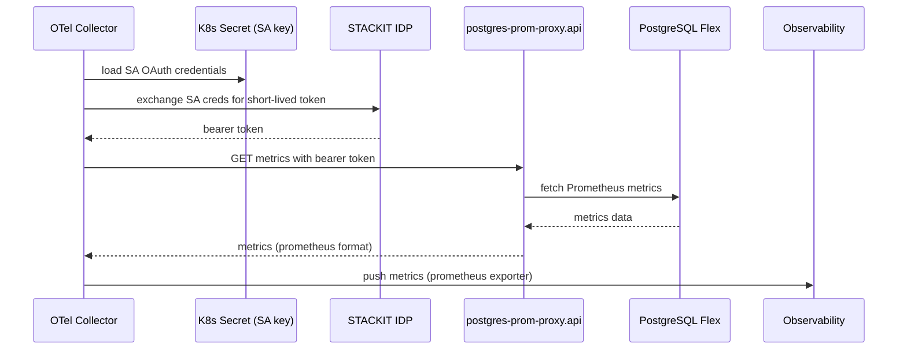
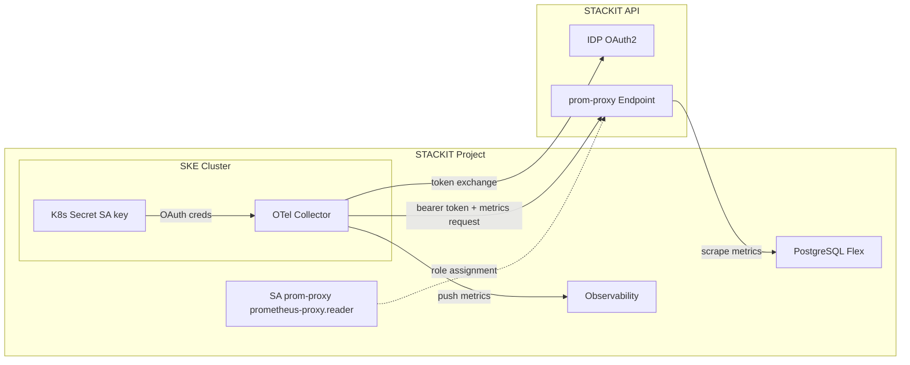

<!-- tags: dbaas, postgresql, otel, observability, metrics, monitoring -->

# DBaaS OpenTelemetry Metrics Collection

Collect metrics from STACKIT PostgreSQL Flex instances using OpenTelemetry (OTel) and export them to STACKIT Observability.

## Architecture

### Metric Flow

1. **SA key mounted as K8s Secret** - The `prom-proxy` service account key (with `prometheus-proxy.reader` role) is stored in a Kubernetes secret.
2. **OTel Collector creates short-lived tokens** - Using the SA OAuth credentials from the secret, the collector creates short-lived STACKIT tokens at runtime.
3. **STACKIT API delivers DBaaS metrics** - The collector calls `postgres-prom-proxy.api.stackit.cloud` with the bearer token to fetch PostgreSQL Prometheus metrics.
4. **Push to Observability** - The collector exports the scraped metrics to STACKIT Observability via HTTPS push.


```mermaid
sequenceDiagram
    participant OT as OTel Collector
    participant SEC as K8s Secret (SA key)
    participant IDP as STACKIT IDP
    participant API as postgres-prom-proxy.api
    participant PG as PostgreSQL Flex
    participant OBS as Observability

    OT->>SEC: load SA OAuth credentials
    OT->>IDP: exchange SA creds for short-lived token
    IDP-->>OT: bearer token
    OT->>API: GET metrics with bearer token
    API->>PG: fetch Prometheus metrics
    PG-->>API: metrics data
    API-->>OT: metrics (prometheus format)
    OT->>OBS: push metrics (prometheus exporter)
```


```mermaid
flowchart LR
    subgraph project[STACKIT Project]
        PG[PostgreSQL Flex]

        subgraph SKE[SKE Cluster]
            OT[OTel Collector]
            SEC[K8s Secret SA key]
        end

        OBS[Observability]
        SA[SA prom-proxy prometheus-proxy.reader]
    end

    subgraph stackit[STACKIT API]
        IDP[IDP OAuth2]
        PPG[prom-proxy Endpoint]
    end

    SEC -- OAuth creds --> OT
    OT -- token exchange --> IDP
    OT -- bearer token + metrics request --> PPG
    PPG -- scrape metrics --> PG
    OT -- push metrics --> OBS
    SA -. role assignment .-> PPG
```

## Prerequisites

- A STACKIT project and a service account key for Terraform, see `stackit_service_account_key_path` in `020-variables.tf`.
- Terraform 1.10 or later and STACKIT provider 0.117.0 or later.
- An authenticated `stackit` CLI (`stackit auth login` or `stackit auth activate-service-account`) and `kubectl` for debugging.

## Usage

1. **Configure**: `cp terraform.tfvars.example terraform.tfvars` and set `stackit_project_id`.
2. **Deploy**:
   ```bash
   terraform init
   terraform apply
   ```

> [!WARNING]
> The service account API generates the private key, and Terraform stores it in plain text in the state. Anyone who can read the state can read the key. This setup is only an example and should not be used this way in production.

The key is valid for 180 days. `time_rotating` replaces it on the first `terraform apply` after day 150, so run `terraform apply` between day 150 and 180, or the collector stops scraping.

## Verify

Open the Grafana URL and query `pg_up` in Explore. A series there shows that the collector scrapes the prom-proxy and pushes to Observability; the value `1` means the exporter reaches the database.

```bash
terraform output -raw grafana_url
```

## Scrape Configuration

The OTel Collector scrapes metrics from:

- **PostgreSQL**: `https://postgres-prom-proxy.api.stackit.cloud/v2/...`

_Note: MSSQL is not supported._

## Debugging

View live scrape data in the collector logs:

```bash
eval "$(terraform output -raw kubeconfig_command)"
kubectl config use-context "$(terraform output -raw ske_cluster_name)"
kubectl logs deploy/otel-collector -n monitoring -f
```

## Clean up

```bash
terraform destroy
```

`terraform destroy` removes everything the example created.

## Documentation

- [PostgreSQL Flex Metrics](https://docs.stackit.cloud/products/databases/postgresql-flex/reference/observability-metrics-in-postgresql-flex/)
