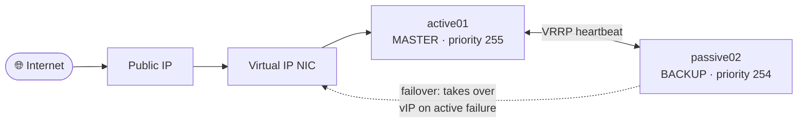
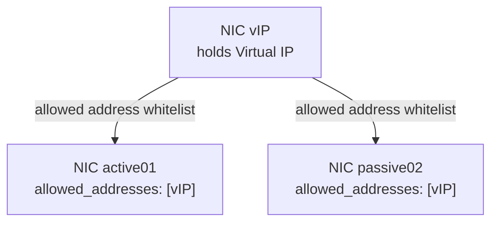

<!-- tags: iaas, ha, vrrp, networking -->

# Basic High Availability Setup Using VRRP

This guide provides a comprehensive, step-by-step process for setting up a Basic High Availability (HA)
cluster using the Virtual Router Redundancy Protocol (VRRP).
In this HA configuration, one virtual machine (VM) functions as the active primary node while the secondary
remains on standby.

> For setup instructions using the STACKIT CLI instead of Terraform, please refer to the [STACKIT CLI Guide](STACKIT-CLI-GUIDE.md).
>
> Before deploying a third-party firewall appliance in HA mode, review the [Public HA Failover-Readiness Checklist](FIREWALL-HA-READINESS-CHECKLIST.md) to verify the appliance meets all cloud and protocol requirements.

## ⚠️STACKIT-Specific Requirement: vMAC-less VRRP

**VRRP on STACKIT requires vMAC-less mode.** Standard VRRP uses a virtual MAC address
(`00:00:5e:00:01:<vrid>`) during failover. STACKIT's network fabric is based on OVN (Open Virtual
Network), which enforces strict MAC anti-spoofing: any packet with a source MAC that doesn't match
the port's registered MAC is dropped. The standard VRRP virtual MAC is not registered on the port
and therefore gets blocked.

The keepalived option `no_virtual_mac` instructs keepalived to use the real NIC MAC in all GARP
(Gratuitous ARP) packets instead of the virtual MAC. OVN allows this because the MAC matches the
registered port MAC.

> **Note on HA approaches across cloud platforms:**
> Other hyperscalers typically solve active-passive HA either via native cloud API integration
> (the failover script calls the cloud API to re-associate a floating IP) or via an L3 Load Balancer
> Sandwich. STACKIT does not yet offer an L3 Load Balancer (this is work in progress), making
> vMAC-less VRRP currently the recommended approach for active-passive HA on STACKIT IaaS.

## Testing the Setup

After completing the setup, use the [test-setup.sh](test-setup.sh) script to verify that the Apache server is operational
on each machine. Executing this script should yield the following results:

```bash
Performing curl on IP: 193.148.177.243
<center><h1>active01</h1>

Performing curl on IP: 193.148.161.92
<center><h1>passive02</h1>

Performing curl on IP: 193.148.169.230
<center><h1>active01</h1>
```

The output indicates a successfully functional VRRP setup.

### Failover Testing

To test failover, stop the active VM and perform another `curl` request to the vIP WAN IP:

```bash
vip01_wan_ip=$(terraform output -raw vip01_wan_ip)
curl $vip01_wan_ip

<center><h1>passive02</h1>
```

The response confirms that the fail-over from the active to the passive node has occurred.

## Diagrams

### HA Traffic Flow



### vIP Binding Concept


