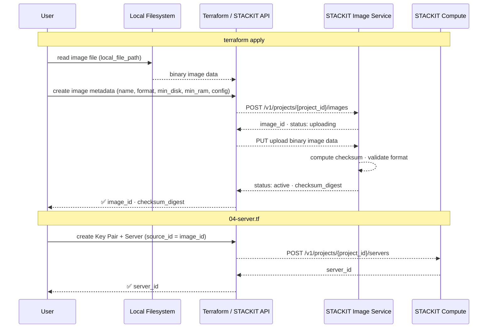

# iaas-image-upload

Upload a custom VM image to STACKIT using Terraform.

This example provisions a single `stackit_image` resource from a local image file. It covers the minimal configuration needed to make a custom image available in a STACKIT project, including disk format, boot requirements, and UEFI/Secure Boot settings.

---

## Architecture



```
STACKIT Project
├── Image: custom-image-v1  (scope: private)
│   ├── Format:   qcow2
│   ├── Min disk: 20 GB
│   ├── Min RAM:  2048 MB
│   └── Config:   uefi=true · secure_boot=false
│
└── Server: custom-image-server
    ├── Machine: g1.1
    ├── Zone:    eu01-1
    └── Boot:    source_type=image · source_id=<image_id>
```

---

## Overview

| Component    | Description                                              |
| ------------ | -------------------------------------------------------- |
| Image upload | Uploads a local image file to the STACKIT Image Service  |
| Boot config  | Configures UEFI and Secure Boot flags via `config` block |
| Labels       | Attaches key-value labels for resource management        |

| In this example               | Not in this example           |
| ----------------------------- | ----------------------------- |
| Upload a custom image         | Image sharing across projects |
| UEFI and Secure Boot settings | Auto-scaling / multiple VMs   |
| Boot a server from the image  | Storage encryption            |
| Image labels                  | DNS / Load Balancer           |

---

## Prerequisites

| Tool            | Version        |
| --------------- | -------------- |
| Terraform       | >= 1.5.7       |
| STACKIT CLI     | latest         |
| STACKIT account | Project access |

### Required STACKIT permissions

The service account used by Terraform must have the following roles assigned in the target project:

| Service         | Role     | Required for                        |
| --------------- | -------- | ----------------------------------- |
| Compute / Image | `editor` | Upload and manage custom images     |
| Compute         | `editor` | Create servers, networks, key pairs |

Assign roles via the STACKIT Portal (Project → Access → Service Accounts) or the CLI:

```bash
stackit project role assign \
  --project-id <project-id> \
  --role compute.editor \
  --service-account-email <sa-email>
```

### Image file

The image file must exist locally before running `terraform apply`. It is **not** included in this repository and must never be committed.

Place your image file in the `images/` directory:

```
images/
└── custom-image.qcow2   ← your local image file (gitignored)
```

Supported formats: `qcow2`, `raw`, `iso`

The most common format for Linux-based virtual machine images is `qcow2`.

### Service account

Create a service account and download its key:

```bash
stackit iam service-account create \
  --project-id <project-id> \
  --name "tf-image-upload-sa"

mkdir -p keys
stackit iam service-account key create \
  --project-id <project-id> \
  --service-account-email <sa-email> \
  --output-format json > keys/sa-key.json
```

---

## Deployment

### 1. Place the image file

```bash
cp /path/to/your/image.qcow2 images/custom-image.qcow2
```

### 2. Configure variables

```bash
cp examples/terraform.tfvars.example terraform.tfvars
# Fill in: project_id, image_name, image_file_path
```

Find your project ID:

```bash
stackit project list
```

### 3. Deploy

```bash
terraform init
terraform plan
terraform apply
```

Duration: depends on image size and upload speed. A 2 GB image typically takes 1–3 minutes.

### 4. Outputs

```bash
terraform output
```

---

## Validation

After a successful `terraform apply`, verify the image in STACKIT:

```bash
# List images in your project
stackit image list --project-id <project-id>

# Show details for the uploaded image
stackit image show --project-id <project-id> --image-id $(terraform output -raw image_id)
```

The `checksum_digest` output can be used to verify the uploaded image matches your local file:

```bash
# qcow2 image checksum (SHA-256)
sha256sum images/custom-image.qcow2
terraform output checksum_digest
```

---

## File Structure

```
iaas-image-upload/
├── .terraform-version              # Terraform version pin (v1.5.7)
├── .gitignore
├── 000-provider.tf                  # stackitcloud/stackit provider
├── 010-variables.tf                 # All variables with descriptions and defaults
├── 020-image.tf                     # stackit_image resource
├── 030-outputs.tf                   # Image ID, name, scope, checksum, server outputs
├── 040-server.tf                    # Optional: server + network from the uploaded image
├── examples/
│   └── terraform.tfvars.example   # Example variable values (safe to commit)
├── images/                         # Place your image file here (gitignored)
│   └── .gitkeep
└── keys/                           # SA key JSON — gitignored
```

---

## UEFI and Secure Boot

| Variable      | Default | Description                                              |
| ------------- | ------- | -------------------------------------------------------- |
| `uefi`        | `true`  | Enables UEFI boot; set to `false` for legacy BIOS images |
| `secure_boot` | `false` | Enables Secure Boot; requires `uefi = true`              |

Most modern Linux distributions support UEFI. If your image was built for BIOS boot only, set `uefi = false` and `secure_boot = false`.

Secure Boot requires a signed bootloader. Enable it only if your image explicitly supports it.

---

## Deploy a server from the uploaded image

`04-server.tf` creates a server that boots directly from the uploaded image.
The `source_id` is wired to `stackit_image.custom_image.image_id` — no manual copy-paste of the image UUID needed.

Provide your SSH public key in `terraform.tfvars`:

```hcl
ssh_public_key = "ssh-ed25519 AAAA... your-key-comment"
```

Extend `04-server.tf` with `stackit_network` and `stackit_network_interface` resources if network connectivity is required.

The default SSH user depends on the operating system of your image (e.g. `debian`, `ubuntu`, `root`).

---

## Security

| File               | Git status | Contains                     |
| ------------------ | ---------- | ---------------------------- |
| `terraform.tfvars` | gitignored | Project ID, sensitive config |
| `keys/`            | gitignored | Service account JSON key     |
| `images/`          | gitignored | Local image files            |

Never commit image files, service account keys, or `terraform.tfvars` to the repository.

---

## Cleanup

```bash
terraform destroy
```

Removes the uploaded image from STACKIT. This does not affect any running instances that were created from the image.

---

## References

- [STACKIT Terraform Provider — stackit_image](https://registry.terraform.io/providers/stackitcloud/stackit/latest/docs/resources/image)
- [STACKIT Developer Documentation](https://docs.stackit.cloud)
- [STACKIT CLI](https://github.com/stackitcloud/stackit-cli)
