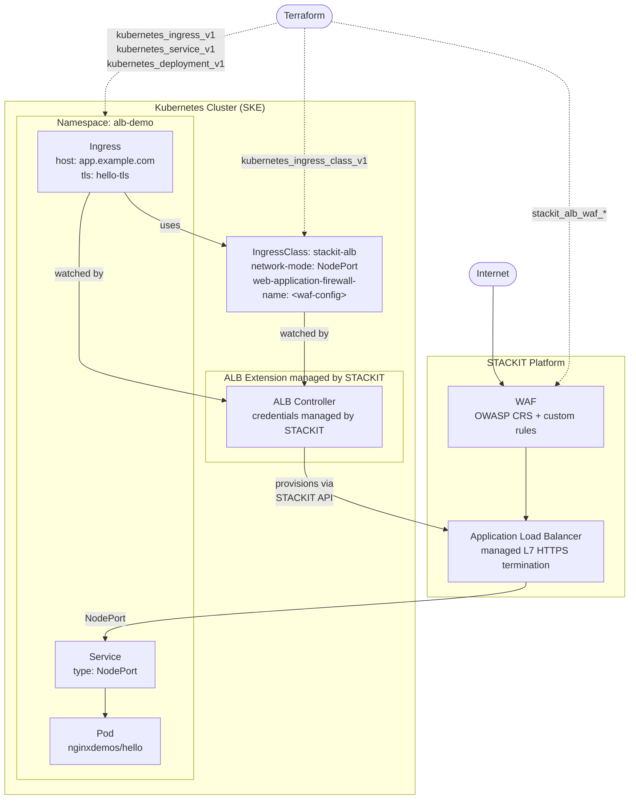

# Architecture SKE ALB Extension with WAF

## L7 Load Balancer Kubernetes Integration

The STACKIT ALB Controller implements the standard Kubernetes Ingress controller pattern: it watches `IngressClass` and `Ingress` objects and translates them into a fully managed STACKIT Application Load Balancer. With the SKE extension, STACKIT deploys and manages the controller itself no manual Pod deployment, RBAC, or credential rotation is required.

## Request flow

1. **Client** sends an HTTPS request to the ALB public IP.
2. **WAF** inspects the request against OWASP CRS rules and any custom rules; blocks matching requests with HTTP 403.
3. **ALB** terminates TLS, matches the `Ingress` host/path rules, and forwards traffic to the node on a NodePort.
4. **NodePort Service** routes the request to a healthy `Pod`.

## WAF attachment

The WAF configuration is attached at the `IngressClass` level via the `alb.stackit.cloud/web-application-firewall-name` annotation. This means every `Ingress` that references this `IngressClass` is automatically protected, no per-Ingress annotation needed.

## Key resources

| Resource                             | Layer      | Managed by                       |
| ------------------------------------ | ---------- | -------------------------------- |
| `stackit_alb_waf_managed_rule_set`   | STACKIT    | Terraform                        |
| `stackit_alb_waf_custom_rule_group`  | STACKIT    | Terraform                        |
| `stackit_alb_waf_configuration`      | STACKIT    | Terraform                        |
| Application Load Balancer            | STACKIT    | ALB Controller (via STACKIT API) |
| ALB Controller                       | Kubernetes | STACKIT (SKE extension)          |
| `IngressClass`                       | Kubernetes | Terraform                        |
| `Ingress` / `Service` / `Deployment` | Kubernetes | Terraform                        |
