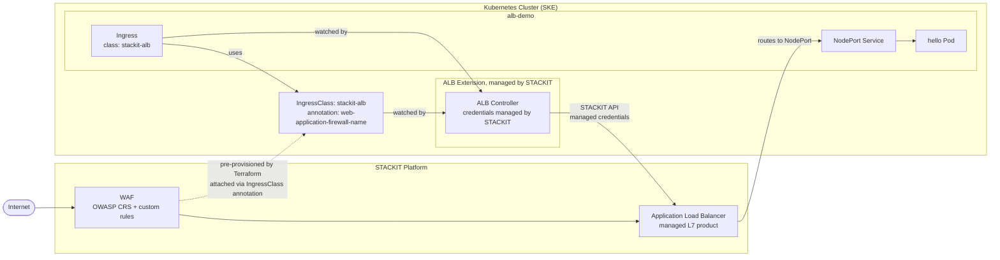

<!-- tags: ske, alb, waf, kubernetes, ingress, load-balancer, managed -->

# SKE ALB Controller Managed Extension

Deploys an SKE cluster with the **Application Load Balancer extension** enabled and wires it to a WAF configuration. STACKIT runs and manages the ALB controller inside the cluster, no manual controller deployment, no service account key management, and no RBAC wiring.

> **Recommended approach for SKE users.**
> The managed extension ensures the controller version, configuration, and credentials are always up to date and aligned with the STACKIT platform. You only manage what matters to your application: the Ingress objects and WAF rules.

> **Private Preview** The ALB extension is currently in private preview. To enable it for your account, open a support ticket with STACKIT. Once enabled, `extensions.application_load_balancer.enabled = true` can be set on any SKE cluster in your organization.

## How it works

The ALB Controller is a Kubernetes controller that watches `Ingress` objects and translates them into STACKIT Application Load Balancers, a fully managed L7 product. With the SKE extension enabled, STACKIT runs and manages the controller inside the cluster. No Pod deployment, no service account key, and no RBAC setup is required from your side.



## What gets created

**STACKIT resources**

- STACKIT Network Area (SNA) + project + node network
- SKE cluster with `extensions.application_load_balancer.enabled = true` and latest supported Kubernetes and Flatcar version (auto-resolved via data sources)
- WAF Managed Rule Set (OWASP CRS), Custom Rule Group, and WAF Configuration

**Kubernetes resources (alb-demo)**

- `IngressClass` `stackit-alb` with `network-mode: NodePort` and WAF annotation
- Demo `Deployment` + `NodePort Service` (`nginxdemos/hello`)
- Self-signed TLS `Secret`
- `Ingress`

No controller deployment, RBAC, service accounts, or credential management is required. STACKIT handles all of that.

## Usage

Requires a service account key with org-level permissions (creates SNA + project).
The ALB extension must be enabled for your account, see the Private Preview note above.

```bash
cp terraform.tfvars.example terraform.tfvars
# edit terraform.tfvars with your values
terraform init
terraform apply
```

Verify connectivity (no DNS needed):

```bash
eval "$(terraform output -raw test_https_command)"
```

Verify WAF is active, both should return `403`:

```bash
eval "$(terraform output -raw test_waf_query_param)"
eval "$(terraform output -raw test_waf_header)"
```

## WAF resources

| Resource                            | Purpose                                                  |
| ----------------------------------- | -------------------------------------------------------- |
| `stackit_alb_waf_managed_rule_set`  | Activates the OWASP Core Rule Set (CRS)                  |
| `stackit_alb_waf_custom_rule_group` | Defines custom block rules                               |
| `stackit_alb_waf_configuration`     | Ties both together; referenced by the Ingress annotation |

> WAF resources are in beta, `enable_beta_resources = true` is set in the provider block.

## Cleanup

```bash
terraform destroy
```
