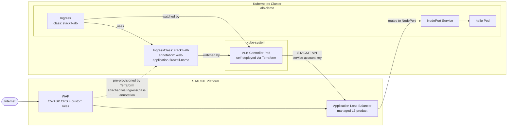

# SKE ALB Controller Self-Installed

Deploys the [STACKIT ALB Controller](https://github.com/stackitcloud/application-load-balancer-controller) manually into an SKE cluster and wires it to a WAF configuration. This gives you full control over the controller lifecycle and configuration.

> **Who should use this?**
> This approach is relevant for anyone hosting their own Kubernetes cluster on STACKIT, including non-SKE clusters (e.g. kubeadm, k3s, RKE2). You manage the controller pod, its service account, RBAC, and key rotation yourself.
>
> If you are running SKE and the [ALB extension](../ske-alb-controller-waf-extension) is available for your account, prefer it over this approach.

> **Do not use this approach for SKE clusters.**
> STACKIT plans to enable the ALB controller by default for new SKE clusters in the future. Running a self-installed controller alongside the managed one can cause conflicts, for example due to differing labels that make the controllers fight over the same resources. Use the [managed extension](../ske-alb-controller-waf-extension) for SKE instead.

## How it works

The ALB Controller is a Kubernetes controller that watches `Ingress` objects and translates them into STACKIT Application Load Balancers, a fully managed L7 product. In this example the controller runs as a regular Pod deployed by Terraform, authenticating to the STACKIT API with a service account key.



## What gets created

**STACKIT resources**

- STACKIT Network Area (SNA) + project + node network
- SKE cluster with latest supported Kubernetes and Flatcar version (auto-resolved via data sources)
- Service account with a least-privilege custom role (`alb.loadbalancer.*`, `alb.targetpool.replace`, `alb.certificateservice.certificate.*`) and an auto-rotating key (90-day TTL, rotated after 80 days)
- WAF Managed Rule Set (OWASP CRS), Custom Rule Group, and WAF Configuration

**Kubernetes resources (kube-system)**

- `ServiceAccount`, `ClusterRole`, `ClusterRoleBinding`, `Role`, `RoleBinding` for the controller
- `ConfigMap` with `cloud.yaml` (project, region, network ID)
- `Secret` with the service account key

**Kubernetes resources (alb-demo)**

- `IngressClass` `stackit-alb` with `network-mode: NodePort` and `web-application-firewall-name` annotation
- Demo `Deployment` + `NodePort Service` (`nginxdemos/hello`)
- Self-signed TLS `Secret`
- `Ingress`

## Usage

Requires a service account key with org-level permissions (creates SNA + project).

```bash
cp terraform.tfvars.example terraform.tfvars
# edit terraform.tfvars with your values
terraform init
terraform apply
```

Verify connectivity (no DNS needed):

```bash
eval "$(terraform output -raw test_https_command)"
```

Verify WAF is active, both should return `403`:

```bash
eval "$(terraform output -raw test_waf_query_param)"
eval "$(terraform output -raw test_waf_header)"
```

## Cleanup

```bash
terraform destroy
```
