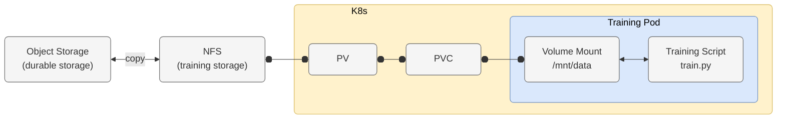
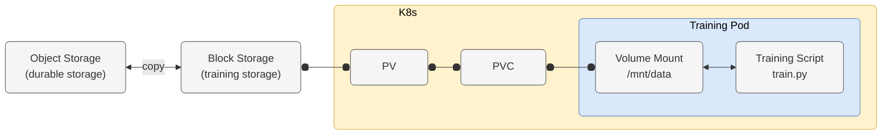
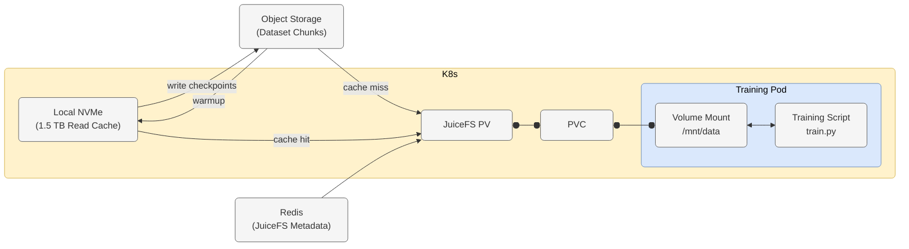

<!-- tags: ske, juicefs, csi-driver, s3, object-storage, rwx, read-write-many, redis, kubernetes -->

# Data storage options for single-node GPU training on SKE with NVIDIA H100

This note describes several data storage options to support single node foundation model training on STACKIT Kubernetes Engine (SKE) with a focus on NVIDIA H100 nodes for computer vision and automotive applications. This includes **data hydration** (making data available for GPUs to achieve optimal GPU-utilization) and **checkpoint persistence** (writing and loading of training checkpoints for recovery) using STACKIT Object Storage.

## NVIDIA Reference Architecture Recommendations

A crucial point in infrastructure setups for foundation model training is an efficient data hydration pipeline, which ensures that GPUs are supplied with training data at a suitable rate, so that GPU-utilization is sufficiently high to avoid **GPU starvation**. In order to establish a baseline for storage throughput, we use the recommendations from the [NVIDIA DGX SuperPOD Storage Architecture Guide](https://docs.nvidia.com/dgx-superpod/reference-architecture-scalable-infrastructure-h100/latest/storage-architecture.html).

NVIDIA defines single-node read requirements for an 8x H100 system across three tiers

- Good: 4 GB/s per node
- Better: 8 GB/s per node
- Best: 40 GB/s per node

NVIDIA explicitly singles out automotive and computer vision (ADAS) workloads due to high-resolution, uncompressed video and radar/camera frame datasets:

> Use cases in automotive and other computer vision-related tasks, where 1080p images are used for training (and in some cases are uncompressed) involve datasets that easily exceed 30 TB in size. In these cases, 4 GBps per GPU for read performance is needed.

For a single-node 8x H100 GPUs, this calculates to

$$
\text{Required Throughput} = \text{8 GPUs} \times \text{4 GB/s/GPU} = \text{32 GB/s}
$$

As the absolute minimal requirement for storage throughput we set **10 GB/s** (~80 Gbps) to avoid GPU starvation.

## STACKIT Option 1 - File Storage

### File Storage Bandwidths

The STACKIT File Storage ("File Storage") service provides a high-performance file storage system, which can be mounted via Network File System (NFS) by multiple clients. The two main concepts in File Storage are

- **Resource Pools**: Logical container for shares
- **Shares**: Logically defined file system within a resource pool

A resource pool contains a collection of shares. Resource pools have a capacity limit of 20 TB. They can be configured with the following storage performance classes

| Performance class | IOPS per TiB | Throughput Density  (MiB/s per TiB) |
| -: | -: | -: |
| Standard | 1000 | 16 |
| Premium | 4000 | 64 |
| Ultra | 10000 | 128 |

where TiB refers to Tebibyte and MiB to Mebibyte. Note that throughput density measures the speed that the storage yields relative to a capacity. It is related to bandwidth according to

$$
\text{Total Bandwidth (GB/s)} = \text{Capacity (TiB)} \times \text{Throughput Density} \biggl(\frac{\text{MiB/s}}{\text{TiB}}\biggr) \times 0.001048576
$$

The following table provides conversion examples of storage sizes to bandwidth for the Ultra performance class:

| Storage  (TB) | Storage  (TiB) | Throughput Density  (MiB/s per TiB) | Total Density  (MiB/s) | Bandwidth  (GB/s) |
| -: | -: | -: | -: | -: |
| 1 | 0.9095 | 128 | 116.42 | 0.122 |
| 5 | 4.5475 | 128 | 582.08 | 0.610 |
| 10 | 9.0949 | 128 | 1,164.15 | 1.221 |
| 20 | 18.1899 | 128 | 2,328.31 | 2.441 |

### NFS integration into SKE

STACKIT File Storage integrates with SKE via the official [NFS CSI driver](https://github.com/kubernetes-csi/csi-driver-nfs), providing `ReadWriteMany` (RWX) volumes across cluster nodes. A ready-to-use example for SKE integration can be found [here](https://github.com/stackitcloud/professional-service/tree/main/examples/ske-stackit-sfs-integration).

The SKE integration looks schematically as follows

**Training Workflow**

- Before model training can start, the training data must be loaded into the NFS share. This can occur as part of the ML pipeline or via a sidecar container launched alongside the Kubernetes training job.
- Once the pod and PVC are deployed, the data from the NFS share becomes accessible within the pod's local POSIX filesystem.
- Checkpoints can be saved directly to this POSIX filesystem by the training scripts. Persisting checkpoints to NFS happens automatically. For long-term durable storage, checkpoints must be copied to STACKIT Object Storage separately (e.g., via a sidecar container using `s5cmd`).

**Evaluation**

- The primary abstraction NFS provides is shared volume access, allowing multiple clients to perform concurrent reads and writes. This synchronization capability introduces metadata overhead for file locks and lookups, which degrades IOPS.
- Since this architecture focuses on a single-node training setup, the RWX feature is not strictly required. However, it may provide flexibility for multi-node distributed training or when multiple training jobs want to access the same training data.
- The maximum throughput of the Ultra performance class (~2.44 GB/s) is insufficient to prevent H100 GPU starvation, which typically requires 10+ GB/s during data hydration. For datasets containing millions of uncompressed image or sensor files, effective bandwidth will be even lower due to small-file RPC overhead.
- Data hydration into the NFS share prior to training, as well as background checkpoint offloading during training, will require STACKIT-specific modifications to existing training scripts.

### Further resources

- [STACKIT File Storage - Documentation](https://docs.stackit.cloud/products/storage/file-storage/)
- [STACKIT File Storage - Service Certificate](https://stackit.com/en/asset/download/42882/file/Service_Certificate_STACKIT_File_Storage.pdf?version=6)
- [STACKIT Professional Service - SFS Example](https://github.com/stackitcloud/professional-service/tree/main/examples/ske-stackit-sfs-integration)

## STACKIT Option 2 - Block Storage

STACKIT Block Storage provides network-attached virtual disk volumes that can be attached to individual VMs or Kubernetes worker nodes. Unlike File Storage (NFS), Block Storage provides direct block-level access, resulting in lower protocol latency and higher IOPS per volume.

STACKIT Block Storage is offered in several [performance classes](https://docs.stackit.cloud/products/storage/block-storage/basics/service-plans/#currently-available-service-plans-performance-classes), where IOPS and throughput scale based on the volume size and chosen tier. The highest performance class is `storage_premium_perf29` with 60,000 IOPS and 1,500 MB/s (1.5 GB/s = 12 Gbps) maximal throughput. For SKE GPU worker nodes, the maximum achievable throughput is typically bounded by the virtual machine's network interface attachment ceiling, which caps out at approximately 24 Gbps (~3.0 GB/s) per attached block volume.

### Block Storage integration into SKE

STACKIT Block Storage integrates natively into SKE via the standard STACKIT CSI driver. Persistent Volumes are requested using standard `PersistentVolumeClaim` manifests with access mode `ReadWriteOnce` (RWO). Because Block Storage is strictly RWO, a volume can only be attached to a single worker node and mounted by pods running on that specific node.

The SKE integration looks schematically as follows

**Training Workflow**

- Before training begins, an init container or pre-processing step downloads the training dataset from STACKIT Object Storage directly onto the mounted Block Storage PVC using high-concurrency tooling like `s5cmd`.
- The training script reads dataset files directly from the local POSIX filesystem path provided by the attached Block Storage volume.
- Training checkpoints are written directly to the Block Storage volume. Because the PVC is `ReadWriteOnce`, external utility pods on other nodes cannot attach to the volume simultaneously. Consequently, checkpoint offloading to STACKIT Object Storage must be handled by a secondary container (sidecar) running within the same training Pod, sharing the PVC volume mount.

**Evaluation**

- Bypassing network filesystem metadata protocols (such as NFS) reduces read latency and improves IOPS, making Block Storage better suited for high-throughput reads.
- The ~24 Gbps (~3.0 GB/s) network attachment cap on Block Storage still falls significantly short of the ~10+ GB/s I/O bandwidth required to keep an 8x H100 node fully saturated during intensive data hydration.
- RWO prevents cross-node volume sharing. Checkpoint offloading sidecars must be packaged within the same Pod definition, increasing pod configuration complexity.
- Existing training setups must integrate explicit pre-fetching procedures into their job workflows and configure multi-container Pod specifications for asynchronous checkpoint offloading to STACKIT Object Storage.

### Further resources

- [STACKIT Block Storage - Documentation](https://docs.stackit.cloud/products/storage/block-storage/)
- [STACKIT Kubernetes Engine - Storage Classes](https://docs.stackit.cloud/products/runtime/kubernetes-engine/basics/storage/storage-classes/)

## STACKIT Option 3 - JuiceFS

[JuiceFS](https://github.com/juicedata/juicefs) is an open-source, high-performance distributed POSIX filesystem designed for cloud-native AI/ML workloads. It decouples data storage from metadata management:

- **Data Storage**: Actual file chunks are persisted in STACKIT Object Storage via standard S3 API calls.
- **Metadata Storage**: File metadata (directories, permissions, file attributes) is managed by a high-speed database engine (e.g., Redis or TiKV).

JuiceFS can be configured in two data hydration modes depending on dataset size and access patterns:

- **Mode 1: Local NVMe Caching Mode (Recommended for Iterative Training)**
 JuiceFS utilizes the H100 worker node's 1,536 GB of local NVMe storage as a local read cache. Epoch 0 hydrates the local NVMe cache; subsequent training epochs read data directly from local NVMe storage at 10+ GB/s, bypassing network storage limits.
- **Mode 2: Object Storage Pass-Through Mode (`cache-size=0`)**
 JuiceFS presents a standard local POSIX filesystem interface to PyTorch/TensorFlow dataloaders, but forwards I/O read requests directly to STACKIT Object Storage without persisting data to local disk. Throughput is capped by the SKE worker node's network connection to Object Storage (~24 Gbps / ~3.0 GB/s).

Note that only the machine type `n3.104d.g8` is equipped with NVMe storage.

### JuiceFS integration into SKE

JuiceFS integrates into SKE via the official juicefs-csi-driver. It exposes standard `StorageClass` resources with `ReadWriteMany` (RWX) access modes, backed by STACKIT Object Storage credentials and a Redis/TiKV metadata endpoint. A ready-to-use example for JuiceFS integration can be found [here](https://github.com/stackitcloud/professional-service/tree/main/examples/ske-s3-csi-juicefs).

The SKE integration looks schematically as follows

**Training Workflow**

- Dataset files are stored permanently in STACKIT Object Storage. Copying the dataset to a second storage system is not necessary.
- **Workflow A (Mode 1 - Caching)**: Datasets up to ~1.5 TB fit entirely inside the node's local NVMe drive. During epoch 0 or via juicefs warmup, blocks stream into local storage. Epochs 2+ run at full local NVMe read throughput (10+ GB/s).
- **Workflow B (Mode 2 - Pass-Through)**: Used when the dataset substantially exceeds local NVMe disk space (e.g., multi-terabyte video datasets). Files are streamed on-demand directly from Object Storage via POSIX calls without consuming local host disk space.
- **Checkpoint Persistence (Both Modes)**: Training checkpoints written to the JuiceFS mount path are split into chunks and uploaded asynchronously to STACKIT Object Storage.

**Evaluation**

- Local NVMe caching bypasses network storage attachment ceilings, providing the multi-gigabyte bandwidth required to keep 8x H100 GPUs fully saturated without data starvation.
- For datasets larger than 1.5 TB there are two options
  - Use Mode 2 to read datasets directly from Object Storage. This implies a throughput cap at ~24 Gbps (~3.0 GB/s), which will lead to GPU starvation.
  - Periodically use dataset chunks that fit into the 1.5 TB NVMe storage. This could be done with a sidecar container or a suitable object storage layout with periodic juicefs warmups. This approach is expected to lead to the best GPU-utilization but requires modifications to existing training scripts.

### Further resources

- [JuiceFS Documentation](https://juicefs.com/docs/community/introduction/)
- [JuiceFS CSI Driver Repository](https://github.com/juicedata/juicefs-csi-driver)
- [STACKIT Professional Service - JuiceFS Example](https://github.com/stackitcloud/professional-service/tree/main/examples/ske-s3-csi-juicefs)

## Summary

| Metric/Feature | Option 1:  File Storage (NFS) | Option 2:  Block Storage | Option 3: Juice FS (NVMe Cache) |
| :- | :- | :- | :- |
| Max. Throughput | ~2.44 GB/s (capped by 20 TB limit) | ~3.0 GB/s (capped by VM network) | 10+ GB/s (Local NVMe speed) |
| K8s Access Mode | `ReadWriteMany` (RWX) | `ReadWriteOnce` (RWO) | `ReadWriteMany` (RWX) |
| ADAS IOPS Performance | Poor (RPC lock overhead) | Moderate (Lower block latency) | High (Redis metadata offload) |
| H100 GPU Starvation Risk | High | High | Low (with local cache) |
| Code Changes Required | High (manual staging logic) | High (multi-container sidecars) | Low (without local cache), Medium (with local cache) |

## Recommendation

Option 3 (JuiceFS) is the recommended architecture on STACKIT SKE for this kind of training workload. It leverages the node's local 1,536 GB NVMe drive to deliver 10+ GB/s read throughput (Mode 1), preventing H100 GPU starvation while using STACKIT Object Storage for persistent data and STACKIT Managed Redis for metadata acceleration. For datasets exceeding 1.5 TB, staging training data in sequential working chunks (`juicefs warmup`) provides optimal GPU utilization with minimal training script modification.
