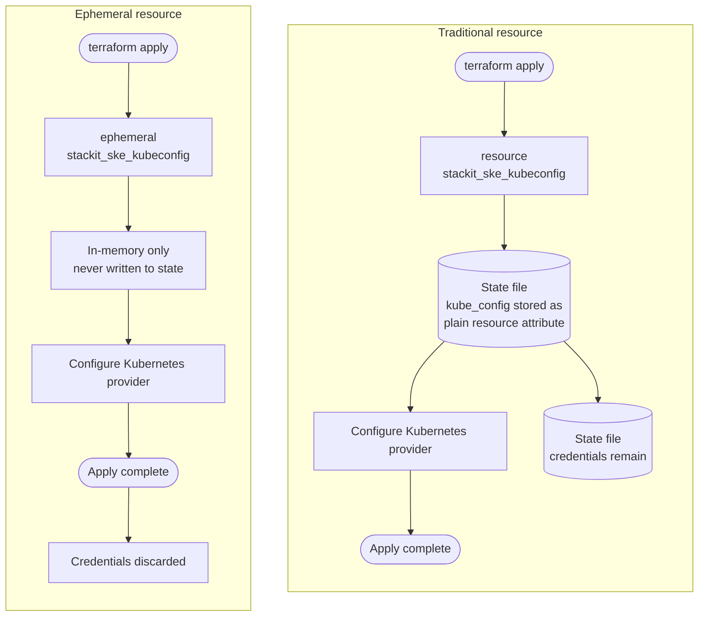

<!-- tags: ske, kubernetes, terraform, provider, kubeconfig, ephemeral -->

# SKE Kubernetes Ephemeral Kubeconfig

## Overview

Deploy an SKE cluster and use an ephemeral kubeconfig to configure the Kubernetes provider without writing credentials to state.

## How it works

Before ephemeral resources were available, connecting the Kubernetes provider to a cluster required a `stackit_ske_kubeconfig` resource. Terraform stores every resource in state, so the kubeconfig ended up persisted in `terraform.tfstate` for the lifetime of the workspace.

The `ephemeral` block changes this: Terraform fetches the kubeconfig at the start of each run, uses it in memory, and discards it when the operation finishes. Nothing is written to state.



The practical difference: anyone with read access to state in the traditional approach can extract valid cluster credentials. With ephemeral resources they cannot, because there is nothing there.

> Ephemeral resources require Terraform >= 1.10 and STACKIT provider >= 0.113.0. On older versions, use the `stackit_ske_kubeconfig` managed resource and restrict state access carefully.

## Usage

### Prerequisites

- Terraform >= 1.10
- A STACKIT project with SKE enabled
- A STACKIT service account key with permissions to manage SKE clusters

### Configure variables

```hcl
project_id                       = "<your-stackit-project-id>"
stackit_service_account_key_path = "/path/to/sa-key.json"
```

### Apply

```bash
terraform init
terraform apply
```
