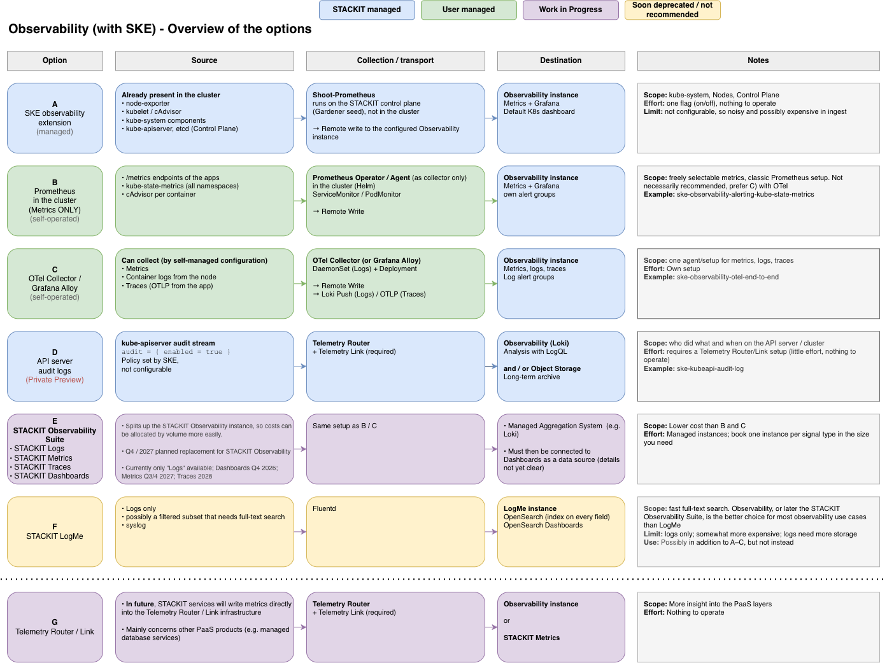

<!-- tags: ske, observability, otel, telemetry, metrics, alerting, log-alerts, kubernetes -->

# SKE Observability

There is more than one way to observe an SKE cluster with STACKIT. The overview shows the options,
who operates what, and where each signal ends up. The subfolders are deployable examples, one per
approach.

## Examples

<table>
  <tr>
    <th>Example</th>
    <th>Option</th>
    <th>Goal</th>
  </tr>
  <tr>
    <td><a href="ske-observability-otel-end-to-end/">ske-observability-otel-end-to-end</a></td>
    <td>A, C, D</td>
    <td>Every signal in one instance with an alert on each: extension, OpenTelemetry Collector, auto-instrumented traces, audit logs</td>
  </tr>
  <tr>
    <td><a href="ske-observability-alerting-kube-state-metrics/">ske-observability-alerting-kube-state-metrics</a></td>
    <td>B</td>
    <td>Metric alerts with Prometheus and kube-state-metrics</td>
  </tr>
  <tr>
    <td><a href="ske-observability-log-alerts/">ske-observability-log-alerts</a></td>
    <td>C (but only Logs configured)</td>
    <td>Log alerts with Grafana Alloy</td>
  </tr>
  <tr>
    <td><a href="ske-kubeapi-audit-log/">ske-kubeapi-audit-log</a></td>
    <td>D</td>
    <td>kube-apiserver audit logs through the Telemetry Router</td>
  </tr>
</table>
