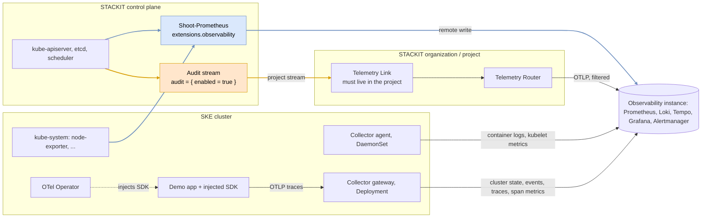

<!-- tags: ske, observability, otel, telemetry, metrics, logging, traces, alerting, auto-instrumentation, audit-log, telemetry-router, kubernetes -->

# SKE Observability End-to-End with OpenTelemetry

Every signal an SKE cluster produces, in one STACKIT Observability instance, with an alert on each
of them: control plane and node metrics from the SKE observability extension, container logs,
Kubernetes metrics and events from the OpenTelemetry Collector, application traces injected by the
OpenTelemetry Operator, and kube-apiserver audit logs through the STACKIT Telemetry Router.

The demo application contains no OpenTelemetry code / SDK. One annotation is needed to collect its traces with its entire integration:

```
annotations = {
  "instrumentation.opentelemetry.io/inject-python" = "true"
}
```

## Architecture



Blue is what `extensions.observability` switches on, orange what `audit = { enabled = true }`
switches on — both run on STACKIT's side. Everything in the default color is created and run by
you through this configuration.

## Signals and alerts

One alert per signal path. The label `source` on every alert names the pipeline it comes from.
Rules live in `070-alertgroup.tf`.

<table>
  <tr>
    <th>Alert</th>
    <th>Signal</th>
    <th>Source</th>
  </tr>
  <tr>
    <td><code>APIServerErrorRateHigh</code></td>
    <td>kube-apiserver 5xx rate</td>
    <td>SKE extension</td>
  </tr>
  <tr>
    <td><code>CoreDNSServfailRateHigh</code></td>
    <td>CoreDNS SERVFAIL rate</td>
    <td>Gateway, <code>prometheus/coredns</code></td>
  </tr>
  <tr>
    <td><code>NodeFilesystemAlmostFull</code></td>
    <td>Node disk below 10%</td>
    <td>Agent, <code>kubeletstats</code></td>
  </tr>
  <tr>
    <td><code>ContainerMemoryNearLimit</code></td>
    <td>Memory above 90% of limit</td>
    <td>Agent + gateway</td>
  </tr>
  <tr>
    <td><code>DeploymentPodsMissing</code></td>
    <td>Fewer Pods than desired</td>
    <td>Gateway, <code>k8s_cluster</code></td>
  </tr>
  <tr>
    <td><code>ServiceErrorRateHigh</code></td>
    <td>Error rate of server spans</td>
    <td>Gateway, <code>spanmetrics</code></td>
  </tr>
  <tr>
    <td><code>ApplicationErrorsInLogs</code></td>
    <td>Error lines in container logs</td>
    <td>Agent, <code>filelog</code></td>
  </tr>
  <tr>
    <td><code>KubernetesWarningEvents</code></td>
    <td>BackOff, FailedScheduling, OOM, FailedMount</td>
    <td>Gateway, <code>k8sobjects</code></td>
  </tr>
  <tr>
    <td><code>SecretReadByHuman</code></td>
    <td>Human <code>get</code>/<code>list</code> on Secrets</td>
    <td>Telemetry Router, audit logs</td>
  </tr>
</table>

`ServiceErrorRateHigh` and `ApplicationErrorsInLogs` fire on purpose: the demo app fails 20% of
its requests. `SecretReadByHuman` only exists with `audit_logs_enabled = true`.

## The components

### SKE observability extension

`extensions.observability` connects the Prometheus that SKE already runs for every cluster to the
instance. It installs nothing in the cluster. It delivers control plane metrics such as
`apiserver_request_total`, plus node-exporter and part of the `kube-system` components. It does not
cover your own namespaces, logs or traces — that is what the Collectors are for.

The extension forwards a fixed selection (managed by STACKIT), not everything the `Shoot-Prometheus` scrapes. E.g. CoreDNS is
not part of it, which is why the gateway collector scrapes CoreDNS itself (`prometheus/coredns`) as an example of scraping custom metrics.

### Why two Collectors: agent and gateway

The names follow the OpenTelemetry documentation, which describes two
[deployment patterns](https://opentelemetry.io/docs/collector/deployment/) for the Collector.
The [Kubernetes getting-started guide](https://opentelemetry.io/docs/platforms/kubernetes/getting-started/)
describes the same two roles but names them after their Kubernetes controller:

<table>
  <tr>
    <th>Here</th>
    <th>OpenTelemetry pattern</th>
    <th>Kubernetes getting-started guide</th>
    <th>Why this controller</th>
  </tr>
  <tr>
    <td>agent</td>
    <td><a href="https://opentelemetry.io/docs/collector/deployment/agent/">Agent</a></td>
    <td><a href="https://opentelemetry.io/docs/platforms/kubernetes/getting-started/#daemonset-collector">Daemonset Collector</a></td>
    <td>Log files and kubelet stats exist on every node, so one Pod per node reads them</td>
  </tr>
  <tr>
    <td>gateway</td>
    <td><a href="https://opentelemetry.io/docs/collector/deployment/gateway/">Gateway</a></td>
    <td><a href="https://opentelemetry.io/docs/platforms/kubernetes/getting-started/#deployment-collector">Deployment Collector</a></td>
    <td>Cluster state and events exist once per cluster, so exactly one Pod reads them</td>
  </tr>
</table>

The gateway in this example does two jobs. It is the
[cluster collector](https://opentelemetry.io/docs/platforms/kubernetes/getting-started/#deployment-collector)
for cluster state and events, and the single OTLP endpoint applications send their traces to. A
gateway in the OpenTelemetry sense is usually scaled out behind a load balancer. This one must
stay at one replica because of its cluster job. If OTLP traffic ever outgrows a single Pod, split
the two jobs into separate Deployments: a single cluster collector, and a scaled OTLP gateway.

### Collector agent (one Pod per node)

<table>
  <tr>
    <th>Preset</th>
    <th>Receiver</th>
    <th>Delivers</th>
  </tr>
  <tr>
    <td><code>logsCollection</code></td>
    <td><code>filelog</code></td>
    <td>The logs of every container in every namespace</td>
  </tr>
  <tr>
    <td><code>kubeletMetrics</code></td>
    <td><code>kubeletstats</code></td>
    <td>CPU, memory, filesystem and network per node, Pod, container</td>
  </tr>
  <tr>
    <td><code>kubernetesAttributes</code></td>
    <td>—</td>
    <td>Namespace, Pod, node and Deployment on every record</td>
  </tr>
</table>

`kubeletstats` sets `insecure_skip_verify`: SKE signs the kubelet's serving certificate with a
separate kubelet CA, so verification against the cluster CA fails and no node, Pod or container
metric arrives. The request never leaves the node and still carries the ServiceAccount token.

The agent reads the log files on the node, so it collects the logs of every Pod in the cluster —
not only the demo application. Nothing has to be changed in the applications. This is the same job
the Grafana Alloy setup in [`ske-observability-log-alerts`](../ske-observability-log-alerts/)
does, with the OpenTelemetry Collector instead.

### Collector gateway (exactly one Pod)

<table>
  <tr>
    <th>Preset / component</th>
    <th>Delivers</th>
  </tr>
  <tr>
    <td><code>clusterMetrics</code></td>
    <td><code>k8s_cluster</code>: state of Deployments, Pods, Nodes, Jobs — kube-state-metrics' job</td>
  </tr>
  <tr>
    <td><code>kubernetesEvents</code></td>
    <td><code>k8sobjects</code>: Kubernetes events as log records, under <code>service_name="kubernetes-events"</code></td>
  </tr>
  <tr>
    <td>OTLP receiver</td>
    <td>Traces from the injected SDK, and any OTLP your own applications send</td>
  </tr>
  <tr>
    <td><code>spanmetrics</code></td>
    <td>Request, error and duration metrics computed from every span</td>
  </tr>
  <tr>
    <td><code>prometheus/coredns</code></td>
    <td><code>coredns_dns_*</code> from the CoreDNS Pods in <code>kube-system</code>, filtered to what the alerts use</td>
  </tr>
</table>

The gateway must run as a single replica. Cluster state and events exist once per cluster; two
replicas would deliver every series twice.

`spanmetrics` exists because alert rules query Prometheus and Loki, not Tempo. The connector
counts every span by service, span name, kind and status, and writes
`traces_span_metrics_calls_total` and `traces_span_metrics_duration_milliseconds_*` to Prometheus.
That makes the error rate of your traces alertable, and it gives you request rate, error rate and
latency per service without instrumenting a single metric.

### OpenTelemetry Operator

The Operator runs an admission webhook. When a Pod carries the annotation, the webhook adds an
init container that copies a prepared SDK into a shared volume, then sets `PYTHONPATH` and the
`OTEL_*` variables on the application container. At interpreter start, Python picks up the
injected path and instruments every library it recognises — here Flask and `requests`.

The `Instrumentation` resource in `060-otel-operator.tf` decides what gets injected: the exporter
endpoint (the gateway), the propagators, the sampler, and extra environment. It sets
`OTEL_PYTHON_LOG_CORRELATION=true`, which is why every log line carries its trace and span ID:

```
2026-09-25 11:30:59,064 ERROR [demo] [app.py:24] [trace_id=c3324f70957e503748f19d926a29db61 span_id=f2a46b5bcc2b520b resource.service.name=logger trace_sampled=True] - Simulated error message 6
```

The Operator collects nothing. It rewrites Pod specs; no span, log or metric passes through it.
Without the gateway, the injected SDK has nowhere to send its traces.

### Telemetry Router — audit logs

For a deeper look, see [`ske-kubeapi-audit-log`](../ske-kubeapi-audit-log/).

## Why k8s_cluster instead of kube-state-metrics

`k8s_cluster` covers the same ground as kube-state-metrics and comes as a chart preset: no extra
Helm release & no scrape configuration. See [documentation](https://opentelemetry.io/docs/platforms/kubernetes/collector/components/#kubernetes-cluster-receiver). The price is different metric names:

<table>
  <tr>
    <th>kube-state-metrics</th>
    <th>k8s_cluster</th>
  </tr>
  <tr>
    <td><code>kube_deployment_status_replicas_available</code></td>
    <td><code>k8s_deployment_available</code></td>
  </tr>
  <tr>
    <td><code>kube_deployment_spec_replicas</code></td>
    <td><code>k8s_deployment_desired</code></td>
  </tr>
  <tr>
    <td><code>kube_pod_status_phase</code></td>
    <td><code>k8s_pod_phase</code></td>
  </tr>
  <tr>
    <td><code>kube_pod_container_status_restarts_total</code></td>
    <td><code>k8s_container_restarts</code></td>
  </tr>
  <tr>
    <td><code>kube_node_status_condition{condition="Ready"}</code></td>
    <td><code>k8s_node_condition_ready</code></td>
  </tr>
</table>

If you depend on the kube-state-metrics names, see
[`ske-observability-alerting-kube-state-metrics`](../ske-observability-alerting-kube-state-metrics/).

## Prerequisites

- A STACKIT project and a service account key with permission to manage SKE, Observability and
  the Telemetry Router
- A free subnet inside the network range of the SNA the project belongs to
- For audit logs: SKE audit logging enabled for your organization. It is in private preview; ask
  STACKIT to enable it. Without it, set `audit_logs_enabled = false`.

## Usage

The `Instrumentation` resource is a custom resource. Terraform needs a working connection to the
cluster and the installed CRD already while it plans it, so on a fresh project the Operator has to
be applied first. A `depends_on` does not help here: it orders the apply, but Terraform plans all
resources before it applies any.

```bash
cp terraform.tfvars.example terraform.tfvars
terraform init
terraform apply -target=helm_release.otel_operator
terraform apply
```

## Cleanup

```bash
terraform destroy
```

## Alternative examples in this repo with granular focus

- [`ske-observability-log-alerts`](../ske-observability-log-alerts/) — logs only, but with Grafana Alloy instead of OTel Collector.
- [`ske-observability-alerting-kube-state-metrics`](../ske-observability-alerting-kube-state-metrics/)
  — metrics only, with the Prometheus Operator (for remote write) and the kube-state-metrics.
- [`ske-kubeapi-audit-log`](../ske-kubeapi-audit-log/) — audit logs only
- [`telemetry-router-hub-spoke-setup`](../telemetry-router-hub-spoke-setup/) — one Telemetry Router
  for many projects
